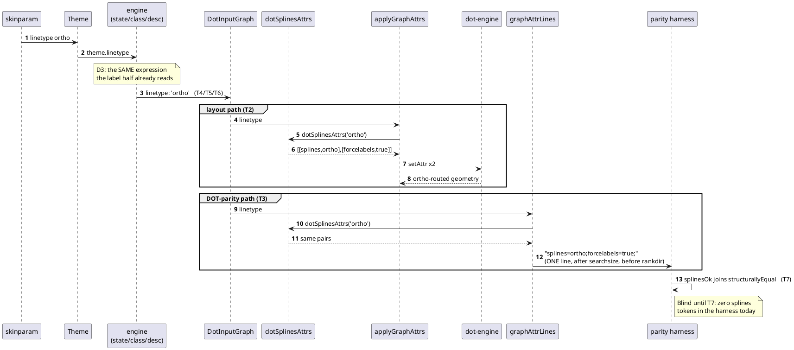

# Data flow — how `linetype` reaches the two emitters

Sequence diagram: multiple participants exchange messages, and *who* calls
*whom in what order* is the point (per `rules/diagrams.md`'s tie-breaker).

## The break, today

Steps 4-9 do not happen. `DotInputGraph` has no `linetype` field, so both
emitters fall through with no splines attribute, and `dot-engine` routes
with default curved splines where the jar routes ortho.
