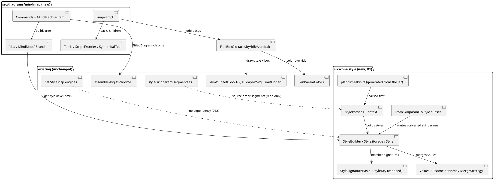

# Component map: what the mission adds and touches

New components are the style engine (`src/core/style/`), the mindmap engine
(`src/diagrams/mindmap/`) and the node box. Existing engines and the flat StyleMap are not
changed (D1, D12); the dashed arrows are read-only seams.

