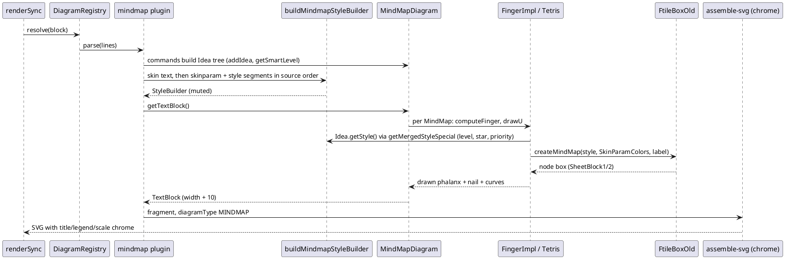

# Data flow: rendering one @startmindmap block

Shows how a mindmap block travels the pipeline after batch 5, and where the new style
engine is built (D2: in the mindmap plugin, never in `buildTheme`).

