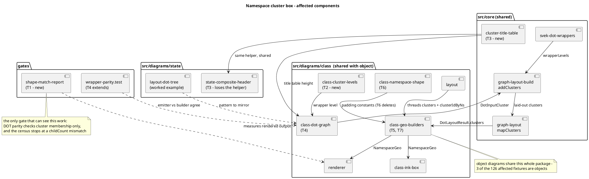

# Component map — what this mission touches

Modified components are tagged with the task that owns them. Anything
untagged is read-only context.

## Boundary that must not move

`svek-dot-wrappers` and `graph-layout-build#addClusters` are **shared with
the state engine and are correct**. This mission wires class into them; it
does not change them. If either looks wrong from inside a class task, that
is a STOP condition, not an edit.
