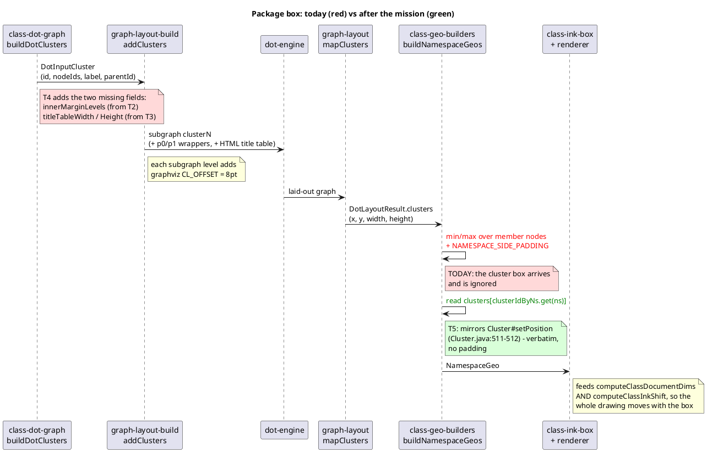
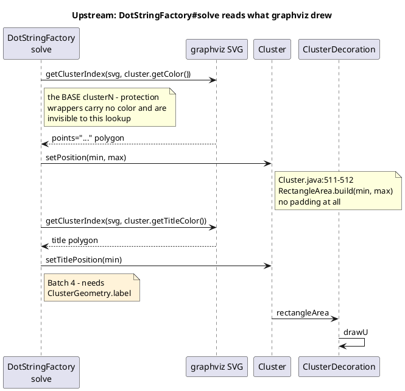

# Data flow — how a package box is produced

## Today, and after the mission

The break is at step 6: the box is invented rather than read. Everything
before it is already correct except the two missing DOT attributes.

## Upstream, for comparison

