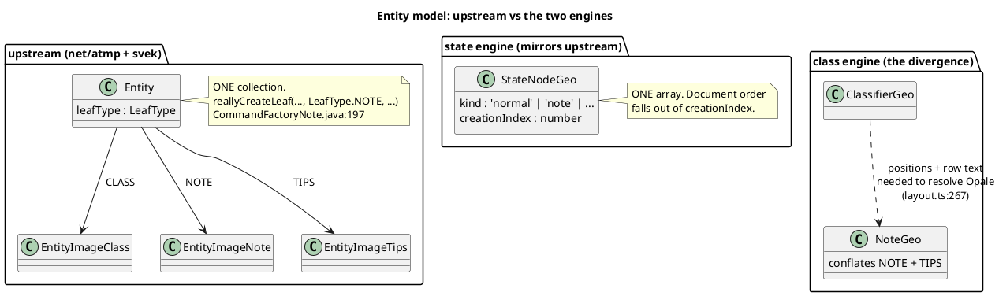
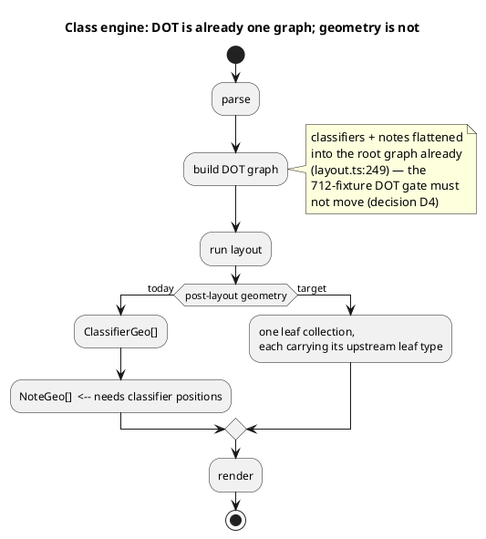

# The three models

Upstream has one collection of polymorphic leaves. State mirrors it. Class
carries a second array alongside.

The dashed edge is the mission's real obstacle: it is a LAYOUT-time
dependency that upstream does not have, because upstream resolves the Opale
connector at DRAW time inside `EntityImageNote#drawU`. Batch 2 removes it;
only then can the two class boxes become one.

## What is already unified

