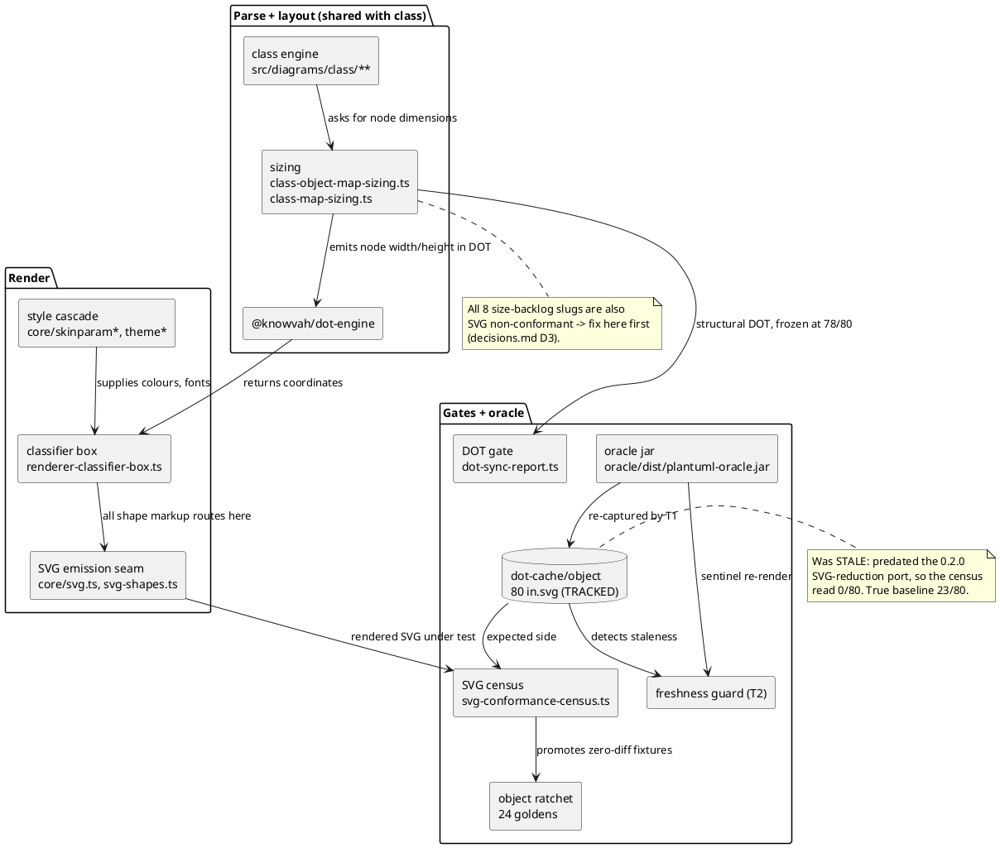

# Component map — what object-close touches

Object diagrams have **no separate engine**: upstream's `ClassDiagramFactory`
registers the object/map commands alongside the class ones, so every object
fixture routes through the class engine. That shared path is why a fix here
can move the class census — and why the class ratchet is a hard boundary
(stop condition 6).

## The seam that matters

`SIZING → DOTENG → BOX` is the propagation path behind `decisions.md` D3: the
DOT is structurally EQUAL at 78/80, so where geometry differs by hundreds of
pixels the cause is the *dimensions fed in*, not the engine's placement of
identical input. Batch-1's T5 exists to establish which side of that seam each
fixture's defect sits on.
