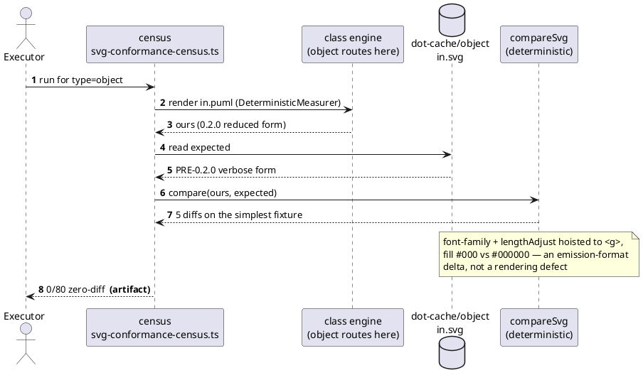
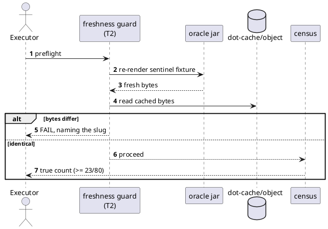
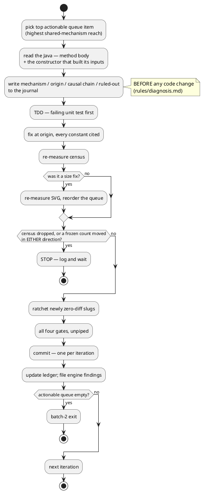

# Data flow — how a census number is produced, and how it lied

## The stale-oracle mechanism (what T1 and T2 fix)

The ratchet stayed green throughout, because its goldens were re-captured with
the 0.2.0 port and the cache was not. **Two gates, one stale, no alarm** —
that gap is what `decisions.md` D4 closes.

## After T1 + T2

Byte comparison, not DOM comparison — a parsed DOM hides exactly the
entity-form and colour-form differences that caused the original miss.

## Iteration flow (batch-2)

