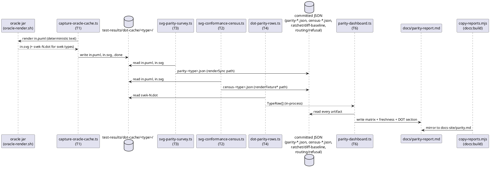

# Data flow — producers, artifacts, dashboard, site

Who produces which artifact and in what order, for T7.

```plantuml
@startuml
participant "oracle jar\n(oracle-render.sh)" as Jar
participant "capture-oracle-cache.ts\n(T1)" as Cap
database "test-results/dot-cache/<type>/" as Cache
participant "svg-parity-survey.ts\n(T3)" as Survey
participant "svg-conformance-census.ts\n(T2)" as Census
participant "dot-parity-rows.ts\n(T4)" as Dot
database "committed JSON\n(parity-*.json, census-*.json,\nratchet/diff-baseline,\nrouting/refusal)" as Json
participant "parity-dashboard.ts\n(T6)" as Dash
participant "docs/parity-report.md" as Report
participant "copy-reports.mjs\n(docs:build)" as Site

Cap -> Jar : render in.puml (deterministic text)
Jar --> Cap : in.svg (+ svek-N.dot for svek types)
Cap -> Cache : write in.puml, in.svg, .done
Survey -> Cache : read in.puml, in.svg
Survey -> Json : parity-<type>.json (renderSync path)
Census -> Cache : read in.puml, in.svg
Census -> Json : census-<type>.json (renderFixture* path)
Dot -> Cache : read svek-N.dot
Dot --> Dash : TypeRow[] (in-process)
Dash -> Json : read every artifact
Dash -> Report : write matrix + freshness + DOT section
Site -> Report : mirror to docs-site/parity.md
@enduml
```
