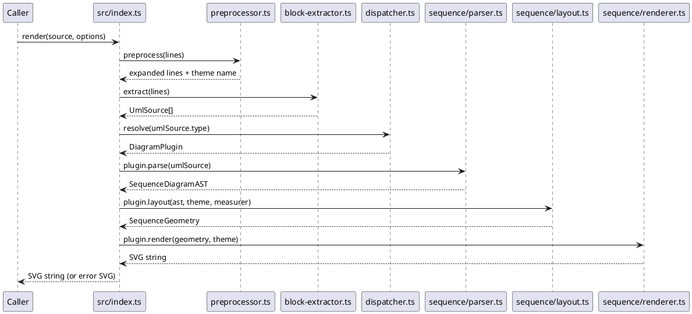

# Data Flow — Render Pipeline

```plantuml
@startuml
participant Caller
participant "src/index.ts" as API
participant "preprocessor.ts" as Pre
participant "block-extractor.ts" as Ext
participant "dispatcher.ts" as Dis
participant "sequence/parser.ts" as Par
participant "sequence/layout.ts" as Lay
participant "sequence/renderer.ts" as Ren
Caller -> API : render(source, options)
API -> Pre : preprocess(lines)
Pre --> API : expanded lines + theme name
API -> Ext : extract(lines)
Ext --> API : UmlSource[]
API -> Dis : resolve(umlSource.type)
Dis --> API : DiagramPlugin
API -> Par : plugin.parse(umlSource)
Par --> API : SequenceDiagramAST
API -> Lay : plugin.layout(ast, theme, measurer)
Lay --> API : SequenceGeometry
API -> Ren : plugin.render(geometry, theme)
Ren --> API : SVG string
API --> Caller : SVG string (or error SVG)
@enduml
```
