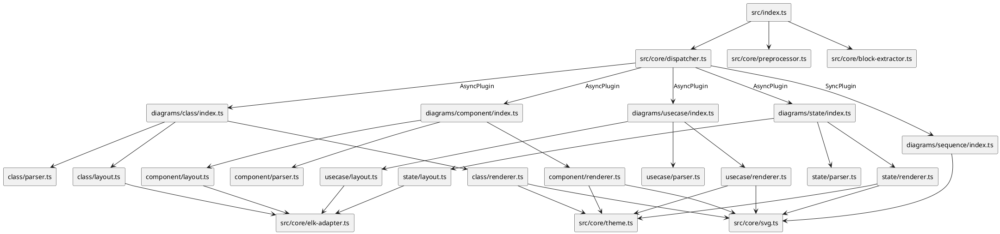

# Component Map — Phase 2

```plantuml
@startuml
skinparam componentStyle rectangle
skinparam shadowing false

[src/index.ts] as API
[src/core/dispatcher.ts] as DISP
[src/core/preprocessor.ts] as PRE
[src/core/block-extractor.ts] as BE
[diagrams/sequence/index.ts] as SEQ
[diagrams/class/index.ts] as CLS
[diagrams/component/index.ts] as COMP
[diagrams/state/index.ts] as ST
[diagrams/usecase/index.ts] as UC
[class/parser.ts] as CLS_P
[class/layout.ts] as CLS_L
[class/renderer.ts] as CLS_R
[component/parser.ts] as COMP_P
[component/layout.ts] as COMP_L
[component/renderer.ts] as COMP_R
[state/parser.ts] as ST_P
[state/layout.ts] as ST_L
[state/renderer.ts] as ST_R
[usecase/parser.ts] as UC_P
[usecase/layout.ts] as UC_L
[usecase/renderer.ts] as UC_R
[src/core/elk-adapter.ts] as ELK
[src/core/svg.ts] as SVG
[src/core/theme.ts] as THEME

API --> DISP
API --> PRE
API --> BE
DISP --> SEQ : SyncPlugin
DISP --> CLS : AsyncPlugin
DISP --> COMP : AsyncPlugin
DISP --> ST : AsyncPlugin
DISP --> UC : AsyncPlugin
CLS --> CLS_P
CLS --> CLS_L
CLS --> CLS_R
COMP --> COMP_P
COMP --> COMP_L
COMP --> COMP_R
ST --> ST_P
ST --> ST_L
ST --> ST_R
UC --> UC_P
UC --> UC_L
UC --> UC_R
CLS_L --> ELK
COMP_L --> ELK
ST_L --> ELK
UC_L --> ELK
CLS_R --> SVG
COMP_R --> SVG
ST_R --> SVG
UC_R --> SVG
SEQ --> SVG
CLS_R --> THEME
COMP_R --> THEME
ST_R --> THEME
UC_R --> THEME
@enduml
```
