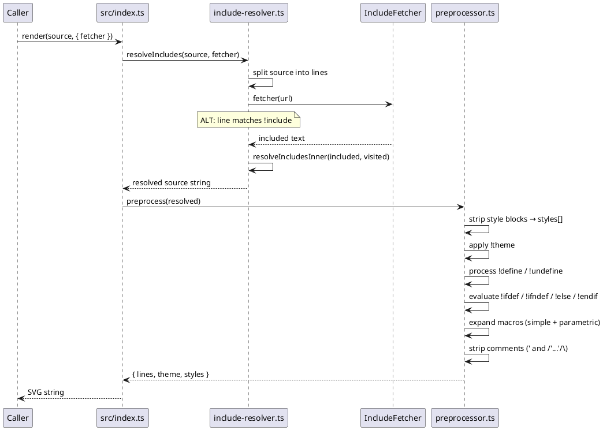
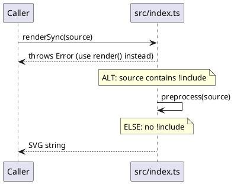
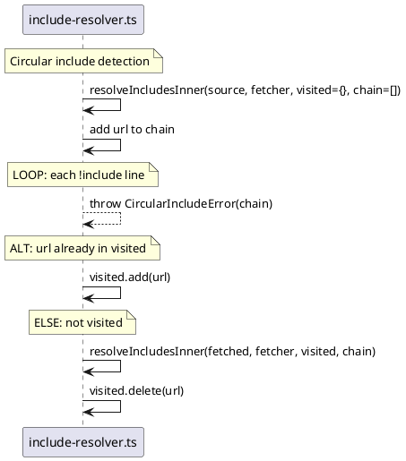

# Data Flow — Preprocessor Pipeline

```plantuml
@startuml
' NOTE: mermaid grouping flattened -- alt/opt/loop/group render the whole
' diagram EMPTY in plantuml-ts today (.agent-notes/plantuml-sequence-group-empty.md).
' Original nesting: loop each line ; alt line matches !include
participant Caller
participant "src/index.ts" as index
participant "include-resolver.ts" as resolver
participant "IncludeFetcher" as fetcher
participant "preprocessor.ts" as preprocessor
Caller -> index : render(source, { fetcher })
index -> resolver : resolveIncludes(source, fetcher)
resolver -> resolver : split source into lines
resolver -> fetcher : fetcher(url)
note over resolver : ALT: line matches !include
fetcher --> resolver : included text
resolver -> resolver : resolveIncludesInner(included, visited)
resolver --> index : resolved source string
index -> preprocessor : preprocess(resolved)
preprocessor -> preprocessor : strip style blocks → styles[]
preprocessor -> preprocessor : apply !theme
preprocessor -> preprocessor : process !define / !undefine
preprocessor -> preprocessor : evaluate !ifdef / !ifndef / !else / !endif
preprocessor -> preprocessor : expand macros (simple + parametric)
preprocessor -> preprocessor : strip comments (' and /'...'/\)
preprocessor --> index : { lines, theme, styles }
index --> Caller : SVG string
@enduml
```

```plantuml
@startuml
' NOTE: mermaid grouping flattened -- alt/opt/loop/group render the whole
' diagram EMPTY in plantuml-ts today (.agent-notes/plantuml-sequence-group-empty.md).
' Original nesting: alt source contains !include ; else no !include
participant Caller
participant "src/index.ts" as index
Caller -> index : renderSync(source)
index --> Caller : throws Error (use render() instead)
note over index : ALT: source contains !include
index -> index : preprocess(source)
note over index : ELSE: no !include
index --> Caller : SVG string
@enduml
```

```plantuml
@startuml
' NOTE: mermaid grouping flattened -- alt/opt/loop/group render the whole
' diagram EMPTY in plantuml-ts today (.agent-notes/plantuml-sequence-group-empty.md).
' Original nesting: loop each !include line ; alt url already in visited ; else not visited
participant "include-resolver.ts" as resolver
note over resolver : Circular include detection
resolver -> resolver : resolveIncludesInner(source, fetcher, visited={}, chain=[])
resolver -> resolver : add url to chain
note over resolver : LOOP: each !include line
resolver --> resolver : throw CircularIncludeError(chain)
note over resolver : ALT: url already in visited
resolver -> resolver : visited.add(url)
note over resolver : ELSE: not visited
resolver -> resolver : resolveIncludesInner(fetched, fetcher, visited, chain)
resolver -> resolver : visited.delete(url)
@enduml
```
