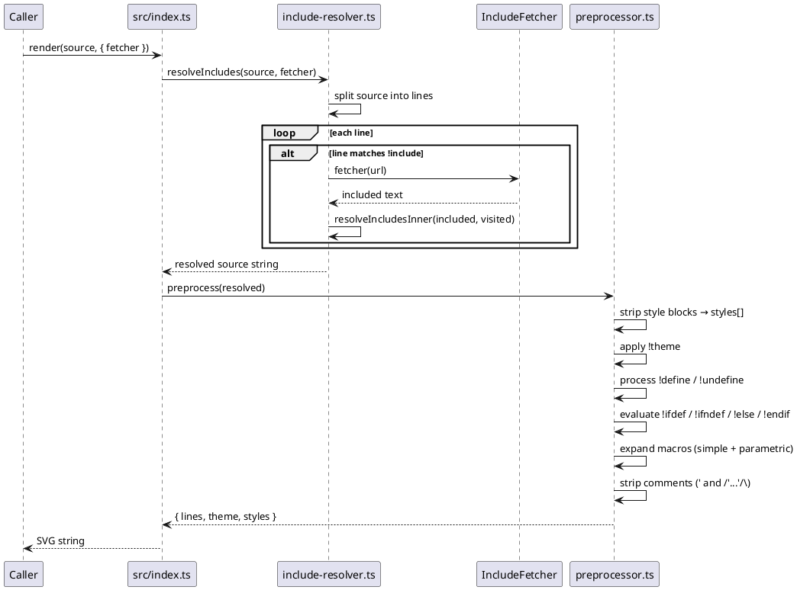
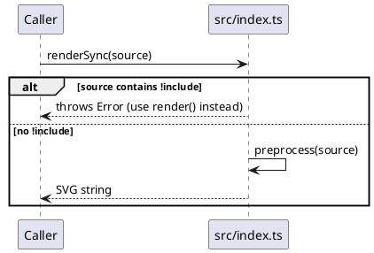
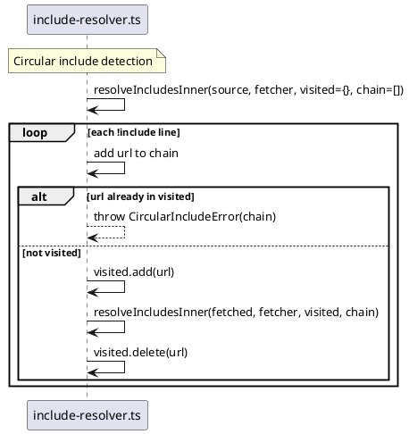

# Data Flow — Preprocessor Pipeline

```plantuml
@startuml
participant Caller
participant "src/index.ts" as index
participant "include-resolver.ts" as resolver
participant "IncludeFetcher" as fetcher
participant "preprocessor.ts" as preprocessor
Caller -> index : render(source, { fetcher })
index -> resolver : resolveIncludes(source, fetcher)
resolver -> resolver : split source into lines
loop each line
  alt line matches !include
    resolver -> fetcher : fetcher(url)
    fetcher --> resolver : included text
    resolver -> resolver : resolveIncludesInner(included, visited)
  end
end
resolver --> index : resolved source string
index -> preprocessor : preprocess(resolved)
preprocessor -> preprocessor : strip style blocks → styles[]
preprocessor -> preprocessor : apply !theme
preprocessor -> preprocessor : process !define / !undefine
preprocessor -> preprocessor : evaluate !ifdef / !ifndef / !else / !endif
preprocessor -> preprocessor : expand macros (simple + parametric)
preprocessor -> preprocessor : strip comments (' and /'...'/\)
preprocessor --> index : { lines, theme, styles }
index --> Caller : SVG string
@enduml
```

```plantuml
@startuml
participant Caller
participant "src/index.ts" as index
Caller -> index : renderSync(source)
alt source contains !include
  index --> Caller : throws Error (use render() instead)
else no !include
  index -> index : preprocess(source)
  index --> Caller : SVG string
end
@enduml
```

```plantuml
@startuml
participant "include-resolver.ts" as resolver
note over resolver : Circular include detection
resolver -> resolver : resolveIncludesInner(source, fetcher, visited={}, chain=[])
loop each !include line
  resolver -> resolver : add url to chain
  alt url already in visited
    resolver --> resolver : throw CircularIncludeError(chain)
  else not visited
    resolver -> resolver : visited.add(url)
    resolver -> resolver : resolveIncludesInner(fetched, fetcher, visited, chain)
    resolver -> resolver : visited.delete(url)
  end
end
@enduml
```
