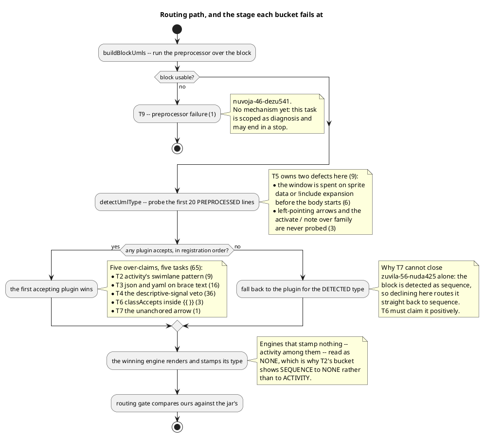

# Where each bucket falls out

One diagram, one question: **on the path from source text to a stamped
`data-diagram-type`, where does each of the 75 defects occur?** Every label
names the task that owns it.

Read it alongside the scope table in [../README.md](../README.md#the-measured-scope--verify-do-not-re-derive),
which names the mechanism and the file for each.

## What the diagram is not saying

**Registration order is not a stage you can edit.** It is frozen
([../decisions.md#d1](../decisions.md#d1)): mirroring upstream's order moves
the gate 79 to 469. The order is compensating for the over-claim rates that
the five `accepts()` tasks reduce.

**A narrowing does not choose a destination.** The "first accepting plugin
wins" box is a loop over an ordered list, so removing one claimant hands the
fixture to the next, not to the right one. That is
[D2](../decisions.md#d2), and it is why three fixtures need two tasks each.
