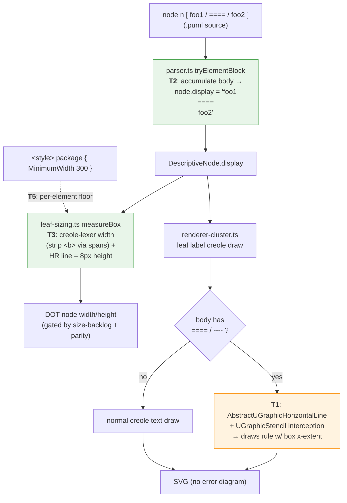

# Data flow — `[ … ]` element body

How a multi-line element body travels from source to sized+rendered box, and
where each task acts.

- **T1** (crux, orange): wire the already-ported HR interceptor into the render
  path so `UHorizontalLine` never reaches `LimitFinder` raw.
- **T2/T3** (green): parser + sizer — substantially prototyped on the WIP branch.
- **T5**: scoped `MinimumWidth` feeds the same `BoxSizingOpts.minimumWidth` seam.
