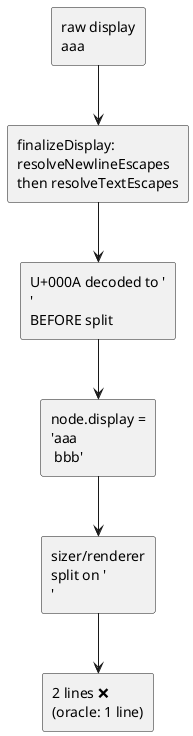
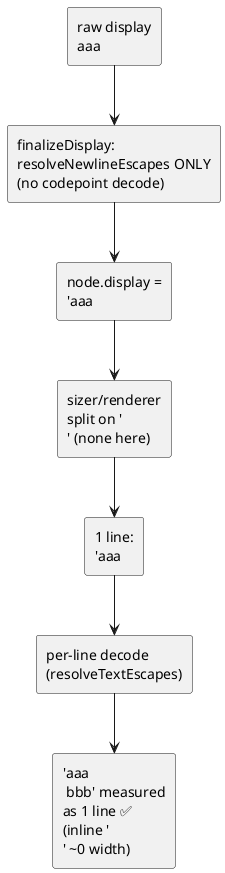
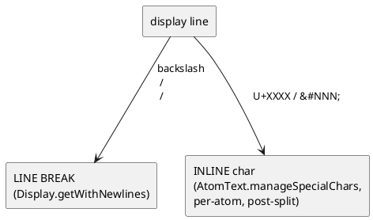
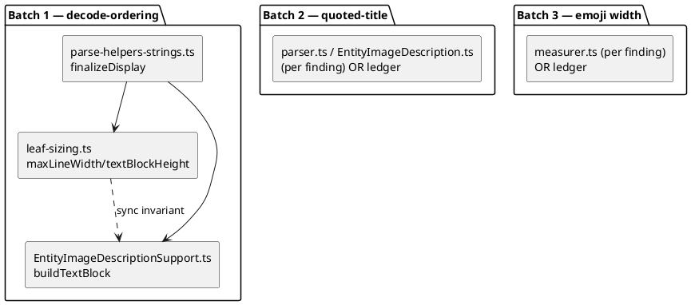

# Data flow — display decode/split pipeline

## The bug (today): decode before split → over-split

## The fix (T1, ADR-1): split first, decode per-line → inline

## Split rule (Rule 1, confirmed)

## Component map (files touched)

