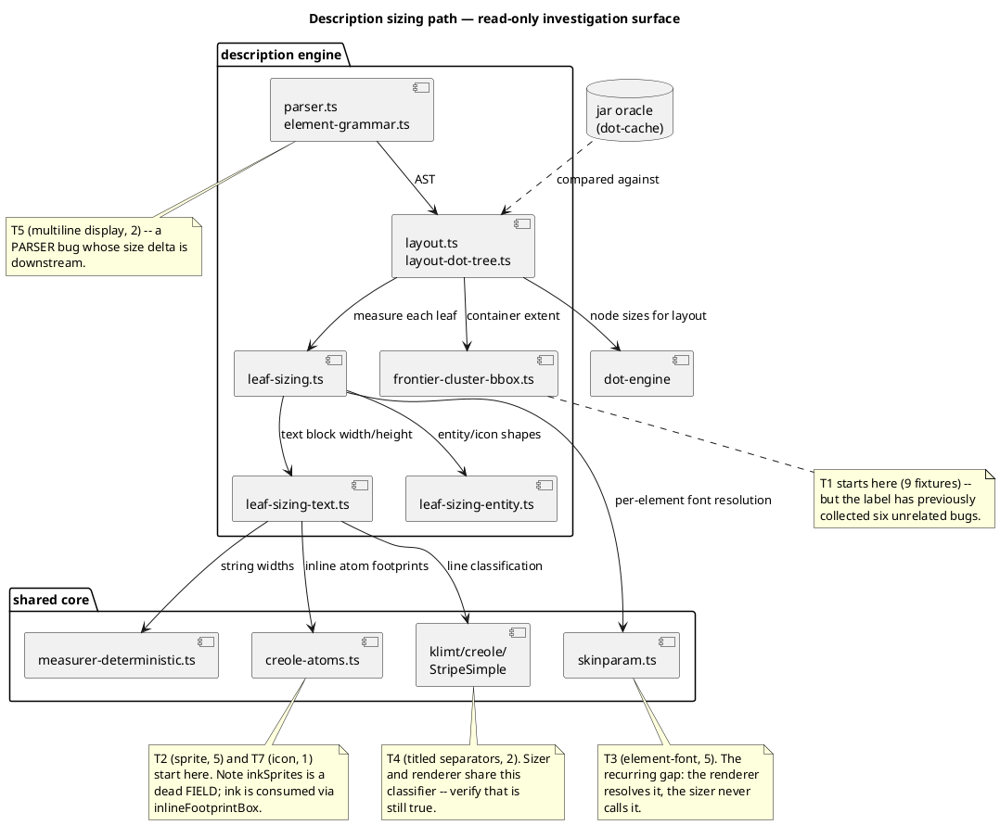

# Modules under investigation

Component rather than class: the question is *what talks to what* along the
sizing path, not the type hierarchy. Every module here is **read-only** for
this mission (ADR-2) — the diagram marks where each bucket's investigation
starts, not where a fix will land.

## The one structural fact worth carrying into the fix mission

`leaf-sizing-text.ts` and `creole-atoms.ts` each sit on **two** buckets' paths
(T4 + T2, and T2 + T7 respectively). That is why the fix mission cannot batch
by bucket, and why T8's write-set overlap column is its most load-bearing
output.
