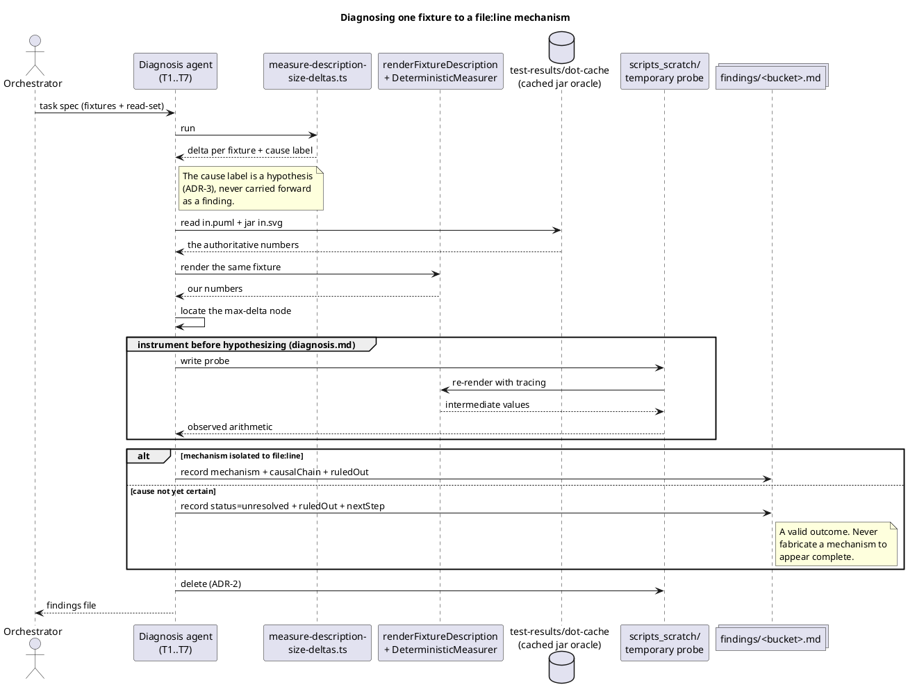

# The diagnosis loop (per fixture)

Sequence rather than activity: the point is *which participant supplies which
evidence*, not merely the order of steps. The jar oracle is the arbiter — no
mechanism claim is admissible without a number that came from it.

## Why the probe is deleted, not kept

ADR-2 makes `src/` read-only and the exit bar mechanically checkable
(`git diff --name-only` contains no `src/` path). A probe left behind under
`scripts_scratch/` is untracked clutter that the next mission would have to
re-verify; the arithmetic it produced belongs in `causalChain`, where it is
reviewable without being re-run.
