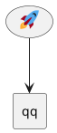

# F4-b — G12 Twemoji artwork for `<:name:>` emoji atoms

Agent: **typescript-pro**. Closes `murava-69-tago286` — **+1 → 345**. Also
fixes an uncovered defect (no golden) folded in from the same file — see
"Fold-in" below.

## Context

`icon.md` G12: our port draws a `<:name:>` emoji atom as a platform-glyph
`UText` (a 21×21 square at font `36*factor`) instead of upstream's Twemoji
SVG artwork — origin `AtomEmoji.ts:61` (`emojiRenderRun`; its own doc
comment at `:56-60` already records the artwork as deliberately unported).

The declared box (`emojiBoxDim`, `AtomEmoji.ts:51`) is correct everywhere —
jar-verified byte-identical (`icon.md` "ruledOut", first bullet: `rectangle
"<:rocket:> Implement the changes"` = `2.481076 × 0.593750` on both sides).
Only the DRAWN shape is wrong, so the defect surfaces exclusively where a
`Footprint` point-collector fits an ellipse (usecase leaves) — it enters
the fit at `EntityImageDescriptionTextBlock.ts:325-329`, which today calls
`emojiRenderRun` and feeds the glyph's own bbox into the collector instead
of the artwork's per-shape corners.

**Proof already done — do not re-derive.** Upstream's point set, hand-
derived from `emoji/data/1f680.svg` (6 shapes, one `UPath` each, min/max
including CONTROL points per `UPath.java:83-95`), fed into our own
`ContainingEllipse` at alpha 0.2 (both sides clamp there — verified,
`icon.md` causalChain) reproduces **192.7579 × 43.3516px = 2.677193 ×
0.602105in — the jar exact to 4 decimals.** This confirms the fix is
"draw the real artwork through the already-ported `Footprint`/
`ContainingEllipse` machinery," not a new geometry algorithm.

## Task

1. **Emoji artwork lookup.** `Emoji.ts` today is a name/codepoint registry
   only (`retrieveEmoji`, `emojiCharacter`). Add the artwork half: given a
   unicode codepoint, return the Twemoji SVG source (the vendored asset).
2. **`AtomEmoji.ts` draw path.** Replace `emojiRenderRun` (`:61`) — or add
   a `drawU` sibling alongside it, since `emojiBoxDim`'s SIZING contract
   must not change — that feeds the artwork through the ALREADY-PORTED
   `src/core/klimt/sprite/SvgNanoParser.ts` (`SvgNanoParser` class,
   `:139`), the same decomposition `render-atoms.ts#resolveSvgSpriteAtom`
   (`:248`) uses for SVG sprites. Reuse that decomposition; do not write a
   second SVG-to-`UPath` parser.
3. **Wire the two `emojiRenderRun` call sites** that draw (not size) an
   emoji to the new artwork path:
   - `EntityImageDescriptionTextBlock.ts:325-329` — the ellipse-fit
     consumer this fixture proves.
   - `EntityImageDescriptionDelegates.ts:187-193` (`descAtomOps.drawU`'s
     emoji branch).
   Both currently call `emojiRenderRun` for DRAWING; both must switch to
   the artwork path. Neither call site's SIZING (`emojiBoxDim`, called
   separately at `:155` in Delegates and `:189` in TextBlock) changes.
4. **`class-member-atom-resolve.ts:95-96`** — third `emojiRenderRun`/
   `emojiBoxDim` consumer (class engine). Move it in lock-step or class
   emoji rows keep the glyph while description rows get artwork —
   an inconsistency a user would notice immediately.
5. **NEW lazy emoji-artwork asset channel.** The Twemoji payload is 1177
   files / 1.75MB uncompressed (`net/sourceforge/plantuml/emoji/data/*.svg`
   in the pinned jar) — cannot go into `src/` as a literal (browser/no-fs
   constraint + per-file line cap) and MUST NOT enter the default bundle
   (ADR-9(b), stop condition 8). Build it as a lazy channel consuming
   F3-seam's sync/async asset-store pair (ADR-2): sync-fillable for the
   harness (this fixture must be measurable in the synchronous
   size-conformance run), lazy `import()` for the browser default.

## Fold-in — emoji-only line height (ADR-7, uncovered, no golden)

Same file, same task, per ADR-7. `EMOJI_LINE_HEIGHT_FACTOR = 39`
(`AtomEmoji.ts:38`) is applied UNCONDITIONALLY at every `emojiBoxDim` call
site (`EntityImageDescriptionTextBlock.ts:189`,
`EntityImageDescriptionDelegates.ts:155`,
`leaf-sizing-folder-title.ts:136`), but upstream's `39*factor` is EMERGENT
from `Sea.doAlign`/`translateMinYto` (`Sea.java:73-88`) only when a TEXT
atom shares the line: `emoji y = -1.5S - 0.125S`, `text y = -S`, min is the
emoji, line bottom lands at `1.625S = 39*factor`. With NO text atom on the
line the max is the emoji's own `1.5S = 36*factor`. Jar `rectangle
"<:rocket:>"` = 41×41px; ours = 41×42.75px (+1.75px = 3×factor at font 14).

`murava-69`'s line is mixed (rocket + text), so it does NOT exercise this
— it needs its OWN authored fixture:



Generate its jar oracle (the pinned command, with the deterministic flag —
see `batch-4/overview.md`), add it to
`oracle/goldens/description/size-backlog.json` as a NEW entry (not a
regeneration — ADR-7 explicitly approves this), and verify the fix against
it.

**Do not condition the height computation on "is this atom's line shared
with the rocket emoji specifically"** — condition it on "does this line
contain any TEXT atom", matching `Sea.doAlign`'s real rule. Read
`Sea.java:73-88` before implementing; do not guess the emergent formula
from the two data points alone.

## Write-set

| File | Change |
|---|---|
| `src/core/klimt/creole/atom/AtomEmoji.ts` | conditional line-height (fold-in); artwork-aware draw contract (may add new exports, must not change `emojiBoxDim`'s signature/return) |
| `src/core/klimt/creole/Emoji.ts` | add artwork lookup by codepoint |
| `src/core/svek/image/EntityImageDescriptionTextBlock.ts` | `:325-329` draw call site; `:189` line-height call site (fold-in) |
| `src/core/svek/image/EntityImageDescriptionDelegates.ts` | `:187-193` draw call site; `:155` line-height call site (fold-in) |
| `src/diagrams/class/class-member-atom-resolve.ts` | `:95-96` draw call site, lock-step |
| NEW lazy Twemoji asset channel | vendored artwork + sync/async store, per F3-seam's pattern |

`leaf-sizing-folder-title.ts:136` also calls `emojiBoxDim` for height — it
is NOT in the declared write-set. If the conditional-height fix requires
touching it, that is a write-set boundary question — ASK FIRST (see
Boundaries), do not silently expand scope.

## Read-set

| File:lines | Why |
|---|---|
| `AtomEmoji.ts` (whole file, 76 lines) | current constants, `emojiBoxDim`, `emojiRenderRun` — the contract not to break |
| `Emoji.ts` (whole file, 257 lines) | current name/codepoint registry pattern to extend |
| `EntityImageDescriptionTextBlock.ts:175-200, 220-330` | both emoji call sites (sizing + draw) |
| `EntityImageDescriptionDelegates.ts:140-200` | both emoji call sites (sizing + draw), `descAtomOps` |
| `class-member-atom-resolve.ts:80-110` | third consumer |
| `src/core/klimt/sprite/SvgNanoParser.ts` (class body, ~`:139`+) | the SVG→`UPath` decomposition to reuse |
| `src/diagrams/description/render-atoms.ts:240-270` | `resolveSvgSpriteAtom` — precedent for feeding parsed SVG through `Footprint` |
| `src/core/svek/image/Footprint.ts` (or wherever `Footprint`/`ContainingEllipse` live) | the point collector this fixture proves is otherwise correct |
| `plans/s1l-tail-diagnosis/findings/icon.md` (whole file) | full mechanism, proof, ruled-out list — do not re-derive |
| `~/git/plantuml/.../klimt/creole/atom/AtomEmoji.java` | `drawU`/`Emoji#drawU` semantics |
| `~/git/plantuml/.../klimt/creole/Sea.java:73-88` | `doAlign`/`translateMinYto` — the emergent line-height rule for the fold-in |
| `~/git/plantuml/.../klimt/UPath.java:83-95` | why control points count toward min/max |
| `~/git/plantuml/.../svek/image/Footprint.java:149-152` | `drawPath` — exactly TWO points per shape |

## Architecture decisions binding this task

- **ADR-2**: consume F3-seam's synchronous asset-store option; do not
  build a second seam.
- **ADR-9(b)** — HARD CONSTRAINT: "Twemoji artwork ships behind the
  optional/lazy channel from ADR-2 — the default bundle must not grow."
  ~1.75MB against a ~1.8MB default bundle would roughly double it.
  **"Default build bundle size unchanged" is an explicit acceptance
  criterion, and bundle growth is stop condition 8** — not a warning, a
  STOP.
- **ADR-7**: the emoji-only-line-height fold-in and its authored fixture
  are approved work under this ADR, in the same task as the fix.
- **ADR-6** (SYNTHESIS §5): no divergence is available here — this is a
  straight fix to match upstream artwork, not a candidate for "reproduce
  faithfully vs. improve."
- **ADR-1**: never write `size-backlog.json` directly for `murava-69`
  (report it closed; orchestrator deletes the pin) — but DO add the new
  authored fixture's entry yourself, since that is a NEW pin, not a
  regeneration of an existing one (ADR-7 explicitly distinguishes these).

## Interface contracts

```typescript
// Emoji.ts — new artwork half, alongside the existing name registry.
export function emojiArtworkSvg(unicodeHex: string): string | undefined;

// AtomEmoji.ts — line-height becomes conditional, not a bare constant.
// Signature change is internal to the module; emojiBoxDim's own return
// shape (`{width, height}`) must NOT change — callers still ask "what is
// this atom's box", the caller now supplies line-context.
export function emojiLineHeightFactor(hasTextSiblingOnLine: boolean): number;
// = hasTextSiblingOnLine ? 39 : 36   (per Sea.doAlign's emergent rule —
// verify against Sea.java:73-88, do not hardcode both constants without
// re-deriving the formula)

// New draw-artwork entry point (name illustrative — match existing
// naming conventions in AtomEmoji.ts / render-atoms.ts):
export function emojiDrawArtwork(
  atom: { readonly unicode: string; readonly factor: number },
  svgSource: string, // from emojiArtworkSvg
): readonly UPath[]; // decomposed via SvgNanoParser, fed to Footprint same as sprite atoms
```

## Acceptance criteria

1. **Given** `usecase "<:rocket:> Implement the changes"` + `[Company]`,
   **when** rendered with the artwork channel filled, **then** the
   usecase node measures `2.677193 × 0.602105in` (conformant against the
   jar) and `murava-69` closes.
2. **Given** the same fixture with the artwork channel NOT filled
   (default browser path, no `import()` resolved yet), **when** rendered,
   **then** it degrades to today's platform-glyph behavior — no throw, no
   layout crash.
3. **Given** the new authored fixture (`usecase "<:rocket:>"` alone, no
   text sibling on its line), **when** measured against its generated jar
   oracle, **then** the node is `41 × 41px` (not `41 × 42.75px`).
4. **Given** a class-diagram member row containing `<:name:>`, **when**
   rendered, **then** it draws the same Twemoji artwork the description
   engine now draws (lock-step, `class-member-atom-resolve.ts`).
5. **Given** `npm run build` before and after this task, **when** the
   output bundle is measured, **then** its size is unchanged (within
   normal build-noise tolerance) — Twemoji assets do not appear in the
   default bundle graph.

## Quality bar

Per README + `batch-4/overview.md`, plus:
- `npx tsx scripts/measure-description-size-deltas.ts` — `murava-69`
  conformant, no widening.
- **Bundle-size check is mandatory and gates this task specifically**
  (ADR-9(b)): `npm run build`, compare `dist/` size before/after. Record
  both numbers in the completion summary.
- New fixture's jar oracle generated and committed under
  `oracle/goldens/description/<new-slug>/` with its `size-backlog.json`
  entry.
- Re-run the class-engine size/goldens ratchet (`class-member-atom-resolve.ts`
  is cross-engine) per README's "creole-atoms* or theme/skinparam layer"
  rule — even though this task's write-set is emoji-specific, not
  creole-atoms* generically, the class engine consumer means class must
  be re-verified.
- 90/90/90 coverage floor on new code.

## Observability

- Completion summary states: bundle size before/after (bytes), the new
  fixture's slug + generated oracle path, and confirmation the class
  engine ratchet was re-run.
- If the artwork channel fails to resolve at runtime (network/import
  failure in a lazy-loading consumer), it must degrade to the existing
  glyph path, not throw — this is a rendering library with no logging
  framework; a silent, correct fallback is the right behavior, not a
  console warning (`~/.claude/rules/logging.md`'s conventions target
  services, not a pure SVG renderer — do not add `console.*` calls to
  `src/`).

## Rollback classification

**Fully revertible.** Unlike F4-a's sprite bundle, Twemoji is Creative
Commons-licensed artwork already used and redistributed by upstream
PlantUML itself under the same terms this project vendors from; no
separate licence-review gate blocks this task (ADR-9(b) gates bundle
SIZE, not licence). A `git revert` cleanly removes the artwork channel and
its call-site wiring.

## Boundaries

**Always do**
- Keep `emojiBoxDim`'s existing signature/return shape stable — every
  caller that sizes (not draws) an emoji must be unaffected.
- Verify the bundle-size delta before declaring the task done.
- Generate the new fixture's oracle with the deterministic flag.

**Ask first**
- If closing the fold-in cleanly requires touching
  `leaf-sizing-folder-title.ts` (outside the declared write-set).
- If `Footprint`/`ContainingEllipse` need a change beyond feeding them a
  different point set (i.e. if the proof in `icon.md` turns out
  insufficient) — that would mean the diagnosis was wrong, which is a
  stop condition (README #3: contradicting an approved finding), not a
  local judgment call.

**Never do**
- Never let the Twemoji payload enter the default bundle graph (stop
  condition 8).
- Never write `oracle/goldens/description/size-backlog.json`'s EXISTING
  entries (only add the new fixture's entry, per ADR-7).
- Never re-implement SVG→`UPath` decomposition — reuse `SvgNanoParser`.

## Commit format

`fix(F4-b): draw Twemoji artwork for emoji atoms`

Body (required, >3 files change): cite the bundle-size before/after
numbers, the new fixture's slug, and the `Sea.doAlign` citation for the
conditional line-height fold-in.
