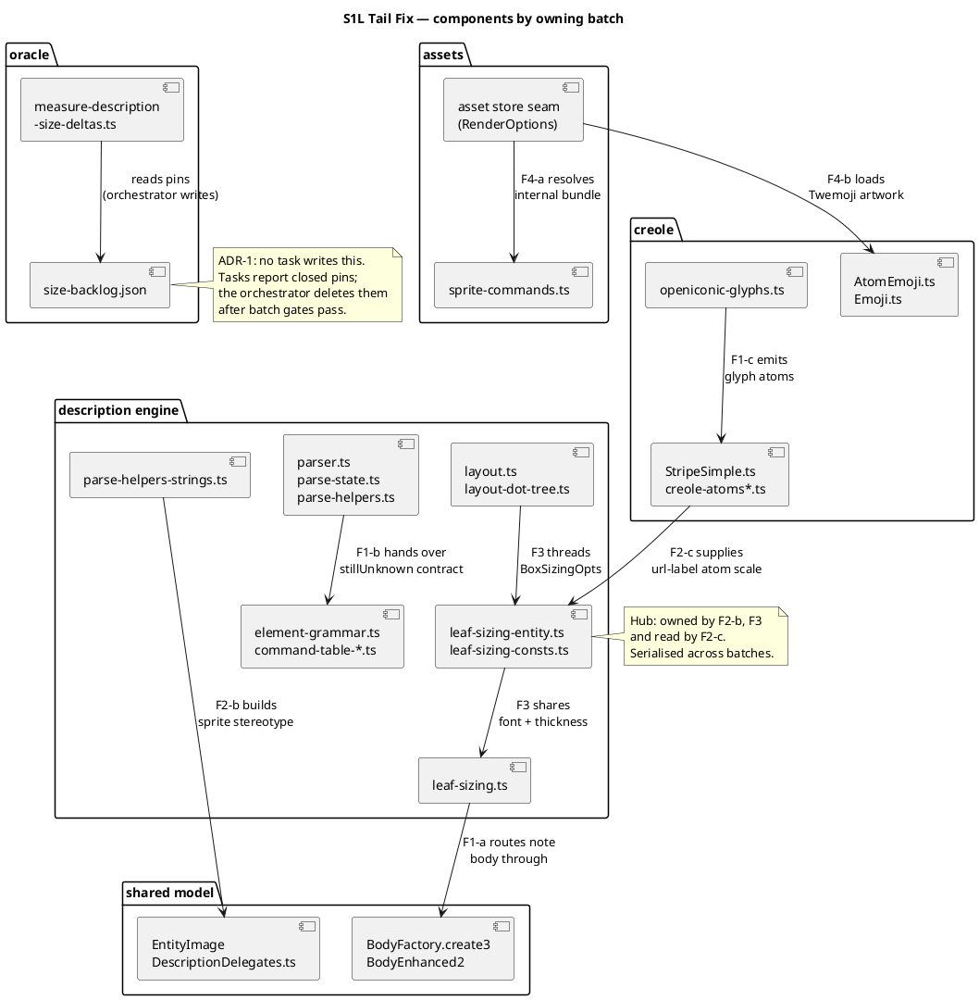

# Component map — modules under change

Which components this mission touches, and which batch owns each. Component
diagram: the question is "what are the parts and their interfaces", not
ordering.

## Ownership hubs

Three files serialise the plan. They are why the batches are ordered as they
are:

| File | Wanted by | Resolution |
|---|---|---|
| `oracle/goldens/description/size-backlog.json` | every group | ADR-1 — orchestrator owns it |
| `src/diagrams/description/leaf-sizing-entity.ts` | G3, G4, G5, G10 | F2-b then F3; F2-c reads only |
| `src/diagrams/description/parse-state.ts` | G1, G6, G8 | F1-b then F2-a |
