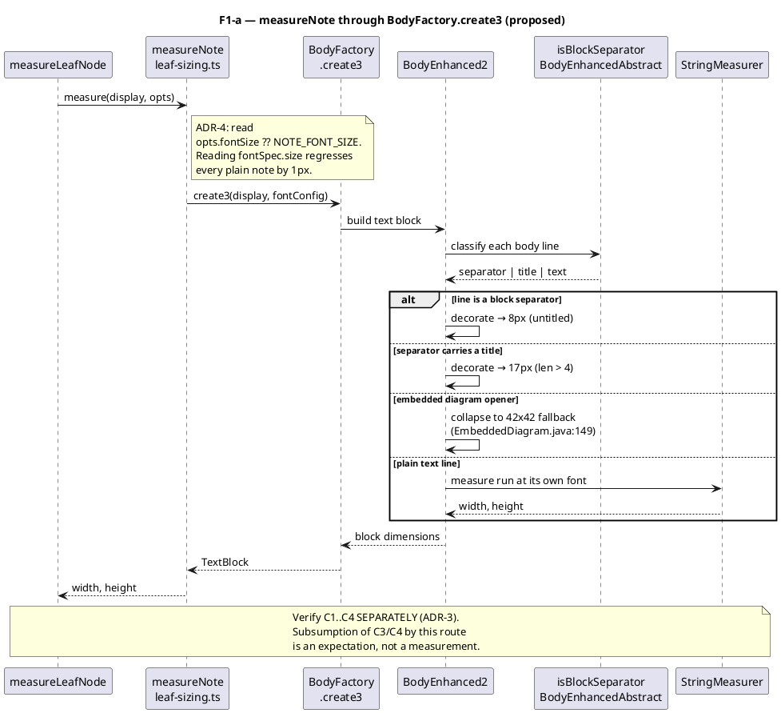

# Data flow — note measurement after F1-a

The highest-value change in the mission: `measureNote` currently models a note
body as flat `lineCount × 13`. This is the **proposed** flow, routing it
through the already-ported text-block model (ADR-3).

Sequence diagram: multiple participants exchanging messages, so *who* does what
matters.

## Why this closes five fixtures

| Cause | Line | Fixtures |
|---|---|---|
| C1 block-separator geometry never applied | `:224` | `xufexu-38`, `pivudu-29` |
| C2 embedded-diagram opener never collapses | `:223` | `kovaxi-11`, `zidebi-71` |
| C3 `NOTE_FONT_SIZE` hardcoded, `opts.fontSize` ignored | `:221` | `tijexo-10` |
| C4 height blind to a run at the img-fallback font | `:224` | `nobiza-91` (residual) |

The jar's own arithmetic, with zero free parameters: note1
`5×13 + (8+17+8+8) + 10 = 116px`; note2 `78 + 41 + 10 = 129px`. Both must
reproduce exactly.
