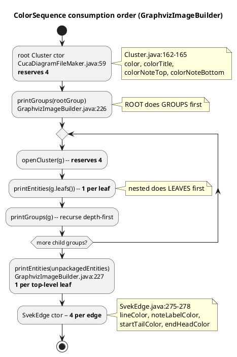

# Svek node-id alignment — `sh####` / `color=` sequence divergence

**status:** FIXED — `idsAligned` 34 → **317 / 356**, all gates green
**found:** 2026-08-07, while probing the F4-f archimate size residual
**blast radius:** `src/core/svek-dot-emit.ts` — shared by all four engines
(description / class / state / object)

## Why this matters

The size gate compares **sorted** dimension lists, because our `sh####` ids do
not align with the oracle's. That makes the metric *identity-free*:
`audit-size-metric-identity.ts` reports `unambiguous: false` on **164 of 356**
fixtures, meaning a swapped-size permutation could hide there. It is masked
today (`falseConformant: 0`, `maxHidden: 0`) but not eliminated.

It also blocks per-node diagnosis outright — an id-keyed probe of the four
archimate fixtures returned nothing but `MISSING in oracle`.

Fixing this does **not** close any size pin. It makes them diagnosable.

## Mechanism

We already port upstream's id *scheme* correctly:

| | upstream | ours |
|---|---|---|
| id format | `String.format("sh%04d", color)` (`SvekNode.java:110`) | `shId()` (`svek-dot-emit.ts:36`) |
| counter | `ColorSequence`, first value 2 | `class Seq`, first value 2 |

The divergence is entirely **when the counter is consumed**. Upstream consumes
at object *construction*; we consume at *emission*, and we assign every node id
up front in `assignRecs` (`svek-dot-emit.ts:438`).

### Upstream's exact consumption order

Two asymmetric orders — this is the part that is easy to get wrong:

Root: **groups then leaves** (`:226-227`).
Nested: **leaves then groups** (`printGroup`, `:429-433`).

## Verification — 4 fixtures, predicted before reading

| Fixture | Shape | Predicted | Oracle actual |
|---|---|---|---|
| `turasu-73-zoni468` | flat, 3 leaves | leaves 6,7,8 | `sh0006/0007/0008` ✅ |
| `lesori-32-zeve057` | root→TDevice→TFunction→leaf | 2-5, 6-9, 10-13, leaf **14** | `sh0014` ✅ |
| `ravodu-50-siso430` | identical to `lesori-32` + one skinparam | same | identical delta ✅ |
| `tuliba-37-liza126` | 1 cluster + 3 top leaves + 2 edges | cluster **6**, leaf **10**, top **11,12,13**, edges **14**, **18** | `cluster6`=`#000006`, `sh0010`-`sh0013`, `#00000E`, `#000012` ✅ |

`turasu-73`'s two invisible edges at `#000009` and `#00000D` independently
confirm the 4-per-edge reservation (gap of exactly 4, no labels present).

## Ruled out

- **Not an id format difference** — both sides are `sh%04d` from a counter
  starting at 2.
- **Not cluster-only** — the flat fixture `turasu-73` misaligns too (its
  offset is the *root* cluster's 4, which we never reserve).
- **Not edge-related** — `turasu-73` has no user-authored edges.
- **Not a per-engine bug** — the divergence is in the shared emitter.

## What our emitter does today (the two defects)

1. **No root-cluster reservation.** `Seq` starts at 2 and the first node takes
   it, so every fixture is at least 4 low.
2. **Nodes assigned up front, not in walk order.** `assignRecs` iterates
   `input.nodes` before any cluster exists; clusters then consume the sequence
   *during* emission (`clusterBlock`, `kermorClusterBlock`, `portClusterBlock`),
   and those reserve **2**, not 4.
3. Edges consume *conditionally* (only when labels are present); upstream
   reserves 4 unconditionally at ctor.

## Fix shape

Split assignment from emission: a pre-pass that walks the cluster tree in
upstream's order above and populates `recs` (node → sh/color) plus a
cluster→colors map; emission then only *reads* those.

`src/core/svek-dot-emit.ts` is **486 lines** against the hook-enforced 500-line
cap, so the pre-pass must land in a new module (e.g.
`src/core/svek-dot-sequence.ts`), not inline.

## Safety

- Nothing parses `color=` back out of our emitted DOT (grepped).
- `svek-dot.ts`'s `StructuralDiff` documents ids/colors as **excluded** from
  the parity bar — the ten structural checks do not compare them.
- No snapshot tests exist (0 `toMatchSnapshot`).
- `tests/unit/core/svek-dot-emit.test.ts` wildcards every colour
  (`#[0-9a-f]{6}`) and asserts only `cluster<N>` ids, which come from
  `DotInputGraph`, not the sequence.
- Every `sh####` elsewhere in `src/` and `tests/` is a **comment** citing the
  *oracle's* golden ids, which do not change — those comments get *more*
  accurate after this fix.

## Acceptance — measured

| Metric | Before | After |
|---|---|---|
| `idsAligned` | 34 / 356 | **317 / 356** |
| `falseConformant` | 0 | 0 |
| `understated` | 0 | 0 |
| `maxHidden` | 0 | 0 |
| `conformantSorted` | 346 | 346 |
| description measure | 346/356, widened 0 | 346/356, widened 0 |
| `npm test` | 556 files / 12493 | 556 files / 12493 |

**One prediction in this document was wrong and is corrected here:**
`ambiguousConformant` did **not** move (164 before and after). That metric
asks whether an alternative *sub-tolerance size pairing* exists, which is
independent of whether ids align — aligning ids does not by itself narrow it.

What the fix actually delivers is (a) per-node diagnosis, which was impossible
before, and (b) the *precondition* for making the gate identity-exact. The
gate still compares sorted lists today; switching it to compare by id is now
possible but is a separate change, and it would need the remaining **39**
misaligned fixtures understood first.

## Residual

39 of 356 fixtures still misalign. Not investigated. Likely candidates: note
nodes, group-anchor nodes (`zaent####`), and the kermor/port cluster paths,
whose construction order this pass models from the plain `printGroup` walk
only.
