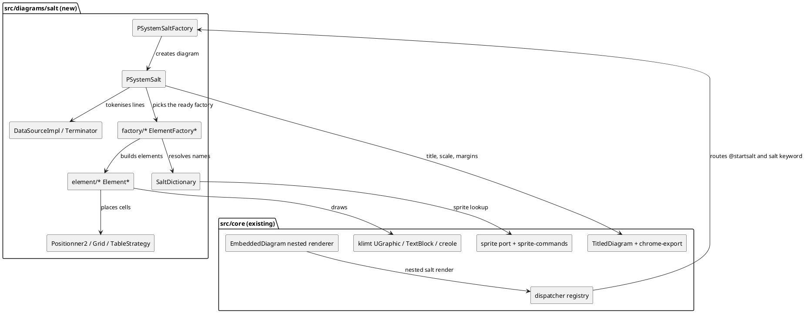

# Component map: salt-engine-port

What the mission adds (salt package) and which existing components it consumes.

```plantuml
@startuml
skinparam componentStyle rectangle
package "src/diagrams/salt (new)" {
  [PSystemSaltFactory] as F
  [PSystemSalt] as S
  [DataSourceImpl / Terminator] as DS
  [factory/* ElementFactory*] as EF
  [element/* Element*] as EL
  [Positionner2 / Grid / TableStrategy] as POS
  [SaltDictionary] as DICT
}
package "src/core (existing)" {
  [dispatcher registry] as REG
  [TitledDiagram + chrome-export] as CHROME
  [klimt UGraphic / TextBlock / creole] as KLIMT
  [sprite port + sprite-commands] as SPR
  [EmbeddedDiagram nested renderer] as EMB
}
REG --> F : routes @startsalt and salt keyword
F --> S : creates diagram
S --> DS : tokenises lines
S --> EF : picks the ready factory
EF --> EL : builds elements
EL --> POS : places cells
EF --> DICT : resolves names
DICT --> SPR : sprite lookup
EL --> KLIMT : draws
S --> CHROME : title, scale, margins
EMB --> REG : nested salt render
@enduml
```
