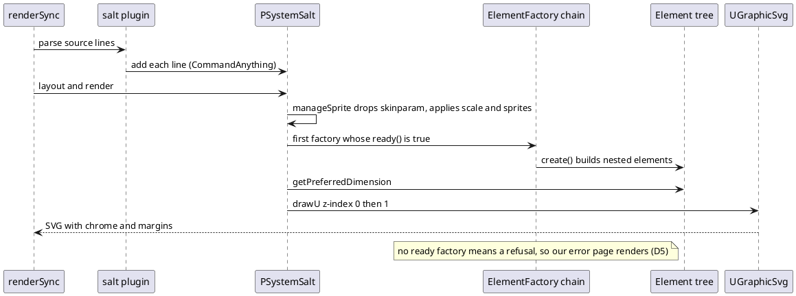

# Data flow: rendering one salt diagram

```plantuml
@startuml
participant "renderSync" as R
participant "salt plugin" as P
participant "PSystemSalt" as S
participant "ElementFactory chain" as F
participant "Element tree" as E
participant "UGraphicSvg" as U
R -> P : parse source lines
P -> S : add each line (CommandAnything)
R -> S : layout and render
S -> S : manageSprite drops skinparam, applies scale and sprites
S -> F : first factory whose ready() is true
F -> E : create() builds nested elements
S -> E : getPreferredDimension
S -> U : drawU z-index 0 then 1
U --> R : SVG with chrome and margins
note over F : no ready factory means a refusal, so our error page renders (D5)
@enduml
```
