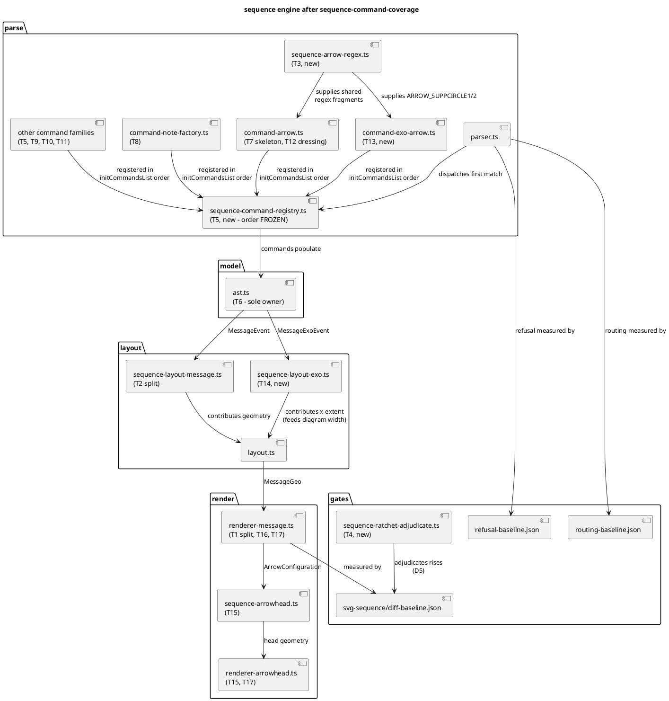

# Component map — what this mission touches

Component diagram: logical structure of the sequence engine after the mission,
with the task that owns each new or changed piece.

## Notes

- `ast.ts` has **exactly one writer** for the whole mission (T6). Every later
  task fills fields it declared. This is what keeps batches 3–6 parallel.
- `sequence-command-registry.ts` order is frozen by D2. A reorder is a stop
  condition, not a fix.
- `sequence-arrow-regex.ts` exists so `CommandArrow` and both exo commands
  share the fragments they share upstream, rather than diverging copies.
