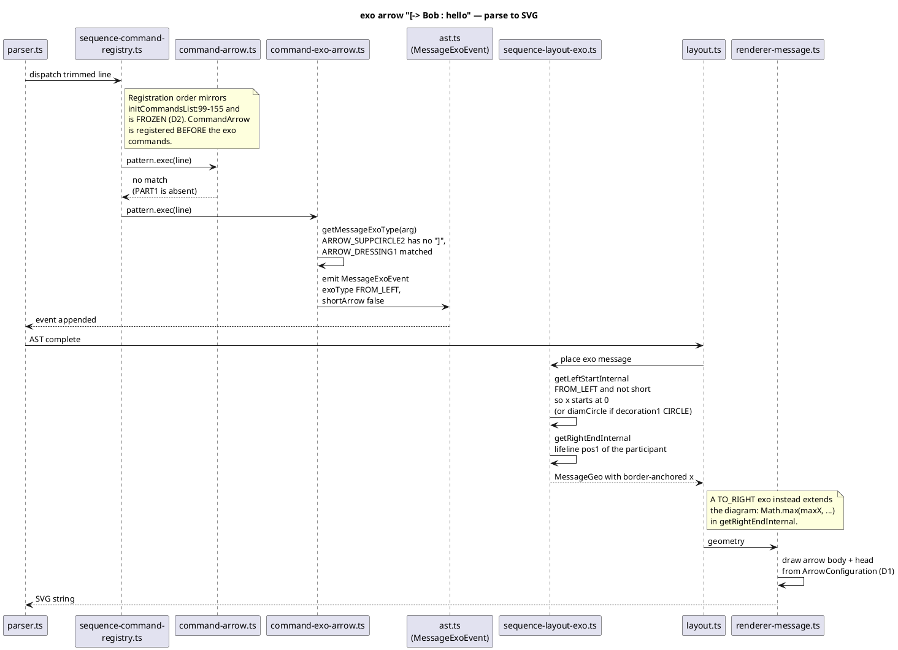

# Data flow — an exo arrow, end to end

The mission's largest bucket (77 fixtures) and its only feature that crosses
parse, layout and render. Sequence diagram: who calls whom, in order, for
`[-> Bob : hello`.

## The dispatch fact this diagram encodes

`CommandArrow` declines `[-> Bob` because its `PART1` group is **absent
entirely** — a leading bare arrow has no left participant to match. That is why
the exo commands are registered after it and still get the line. Six fixtures
are pinned on exactly this reading (`CommandExoArrowLeft.java:60`).

Before the endpoint token was tightened to `PART1CODE`, `\S+` let `PART1`
swallow the `[` and invent a participant named `[` — see
`prior-observations.md#5`. Fifteen fixtures drew a wrong diagram rather than
refusing. Any loosening reintroduces it.
