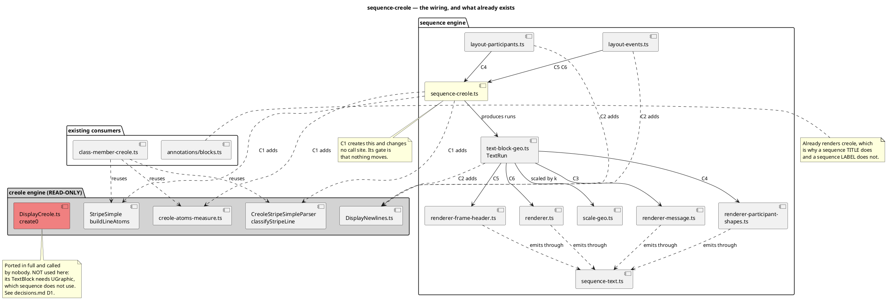

# What this mission touches

The creole engine is read-only here. Every arrow into it already exists for
`class` and `state`; this mission adds the sequence one.

## Not touched

`renderer-lifeline.ts`, `renderer-arrowhead*.ts`, `sequence-page.ts`,
`sequence-layout-message.ts` and the parser. Creole is a text concern; none of
these draw text.
