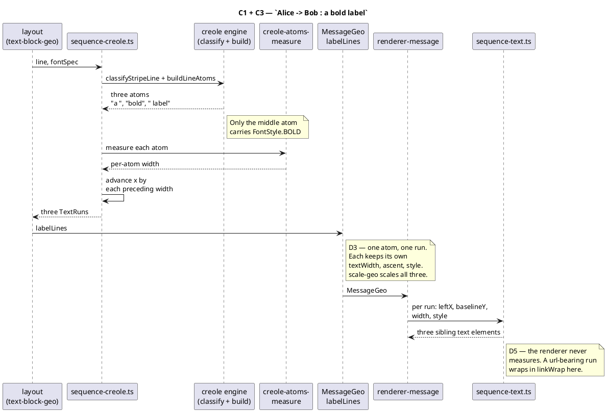
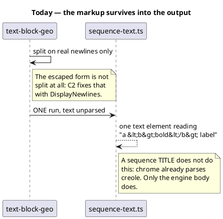

# How a creole label becomes markup

One display string, several runs, several sibling `<text>` elements. The jar
emits creole this way — no `<tspan>` — and the parent mission's `TextRun` array
is already the right carrier (decisions.md D3).

## What this replaces

