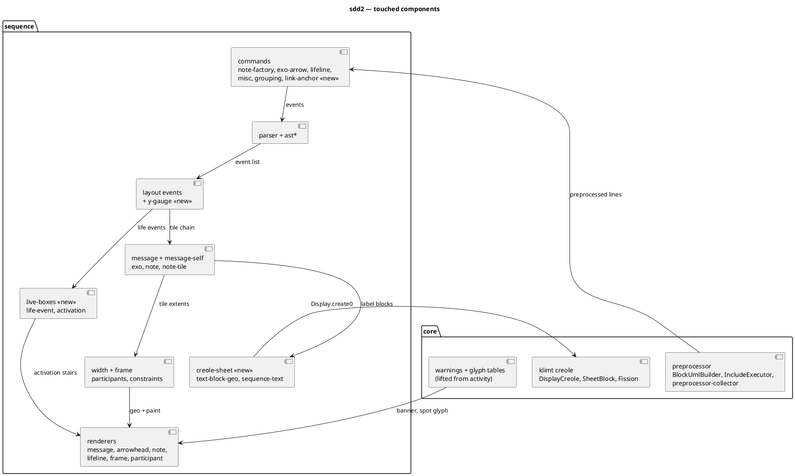

# Component map — modules sdd2 touches

Paths under `src/diagrams/sequence/` unless marked core. New modules are
marked «new».

```plantuml
@startuml
title sdd2 — touched components
package "core" {
  [preprocessor\nBlockUmlBuilder, IncludeExecutor,\npreprocessor-collector] as pre
  [klimt creole\nDisplayCreole, SheetBlock, Fission] as kcreole
  [warnings + glyph tables\n(lifted from activity)] as lift
}
package "sequence" {
  [commands\nnote-factory, exo-arrow, lifeline,\nmisc, grouping, link-anchor «new»] as cmd
  [parser + ast*] as ast
  [layout events\n+ y-gauge «new»] as events
  [live-boxes «new»\nlife-event, activation] as live
  [message + message-self\nexo, note, note-tile] as msg
  [width + frame\nparticipants, constraints] as width
  [creole-sheet «new»\ntext-block-geo, sequence-text] as seqcreole
  [renderers\nmessage, arrowhead, note,\nlifeline, frame, participant] as render
}
pre --> cmd : preprocessed lines
cmd --> ast : events
ast --> events : event list
events --> msg : tile chain
events --> live : life events
msg --> width : tile extents
seqcreole --> kcreole : Display.create0
msg --> seqcreole : label blocks
width --> render : geo + paint
live --> render : activation stairs
lift --> render : banner, spot glyph
@enduml
```
