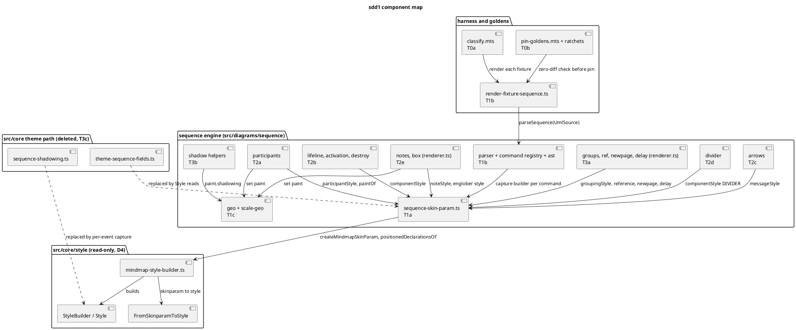

# Component map — what sdd1 touches

Proposed state. Boxes inside "sequence engine" are write-set; `src/core/style`
is read-only (D4); the theme path is deleted in batch 3b (D5).

```plantuml
@startuml
title sdd1 component map
package "src/core/style (read-only, D4)" {
  [mindmap-style-builder.ts] as MSB
  [StyleBuilder / Style] as SB
  [FromSkinparamToStyle] as FSS
}
package "sequence engine (src/diagrams/sequence)" {
  [sequence-skin-param.ts\nT1a] as SSP
  [parser + command registry + ast\nT1b] as PAR
  [geo + scale-geo\nT1c] as GEO
  [participants\nT2a] as F2A
  [lifeline, activation, destroy\nT2b] as F2B
  [arrows\nT2c] as F2C
  [divider\nT2d] as F2D
  [notes, box (renderer.ts)\nT2e] as F2E
  [groups, ref, newpage, delay (renderer.ts)\nT3a] as F3A
  [shadow helpers\nT3b] as F3B
}
package "src/core theme path (deleted, T3c)" {
  [sequence-shadowing.ts] as SSH
  [theme-sequence-fields.ts] as TSF
}
package "harness and goldens" {
  [render-fixture-sequence.ts\nT1b] as RFS
  [pin-goldens.mts + ratchets\nT0b] as PIN
  [classify.mts\nT0a] as CLS
}
SSP --> MSB : createMindmapSkinParam, positionedDeclarationsOf
MSB --> FSS : skinparam to style
MSB --> SB : builds
PAR --> SSP : capture builder per command
F2A --> SSP : participantStyle, paintOf
F2B --> SSP : componentStyle
F2C --> SSP : messageStyle
F2D --> SSP : componentStyle DIVIDER
F2E --> SSP : noteStyle, englober style
F3A --> SSP : groupingStyle, reference, newpage, delay
F3B --> GEO : paint.shadowing
F2A --> GEO : set paint
F2E --> GEO : set paint
RFS --> PAR : parseSequence(UmlSource)
CLS --> RFS : render each fixture
PIN --> RFS : zero-diff check before pin
SSH ..> SB : replaced by per-event capture
TSF ..> SSP : replaced by Style reads
@enduml
```
