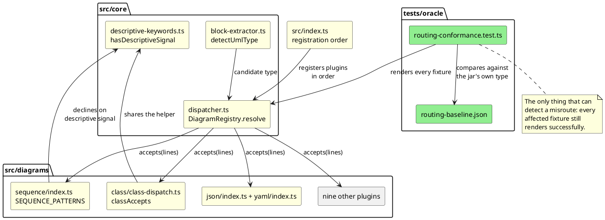

# Component map — what decides what

The decision surface is four modules plus thirteen per-plugin `accepts`
implementations. Highlighted components are written by this mission.

## Ownership per bucket

| Bucket | Component | Task |
|---|---|---|
| 70 sequence underclaims | `src/index.ts` order | T2 |
| fast-path scoping | `dispatcher.ts`, `block-extractor.ts` | T3 |
| `-->` in a string literal | `sequence/index.ts` | T4 |
| `queue`/`entity` over-decline | `descriptive-keywords.ts` | T5 |
| `{...}` in prose | `json/index.ts`, `yaml/index.ts` | T6 |
| `map ... {` object syntax | `class/class-dispatch.ts` | T7 |
