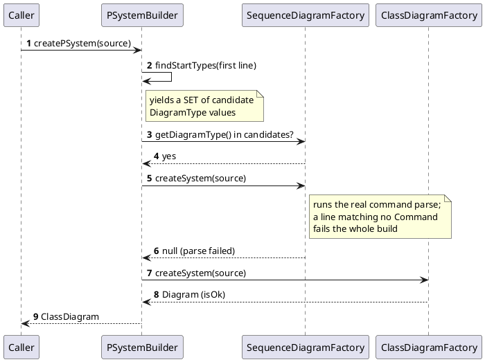
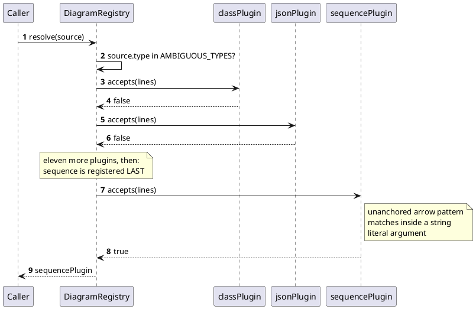
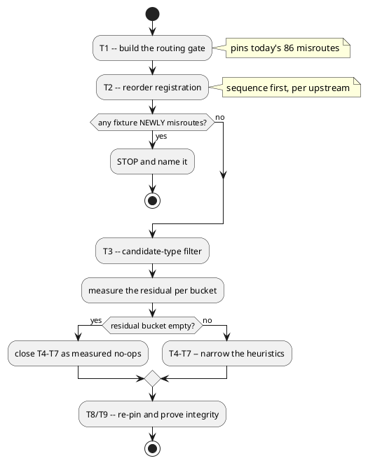

# Data flow — how a source picks its engine

Two procedures for the same decision. Upstream **attempts the parse**; we
**match regexes**. D2 keeps our shape this mission and defers the re-mirror.

## Upstream — `PSystemBuilder.createPSystem`

The decisive property: **failure to parse is the signal**. A source full of
`map`/`!procedure` syntax cannot build a sequence diagram, so sequence
declines itself without any pattern needing to know about `map`.

## Ours — `DiagramRegistry.resolve`

Nothing here ever attempts a parse, so a regex hit on prose or on a string
literal is indistinguishable from a real arrow.

## What each batch changes

