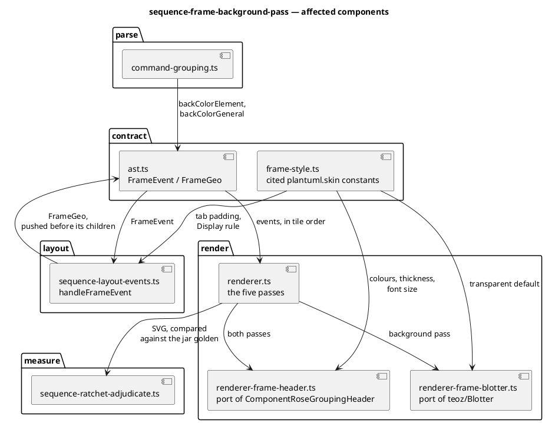

# Component map — what this mission touches

Ports of upstream classes are named for them; the arrow labels say what
crosses each seam.

## Ownership

One writer per file, enforced by the batch tables. `renderer.ts` is written
only by T6; the two component ports are written only by T3 and T4; the
contract only by T1.
