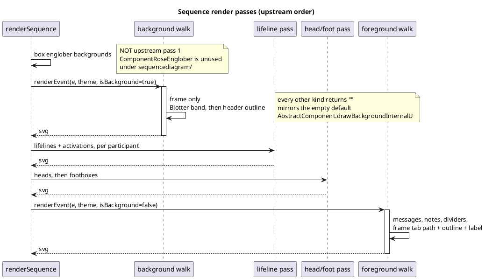
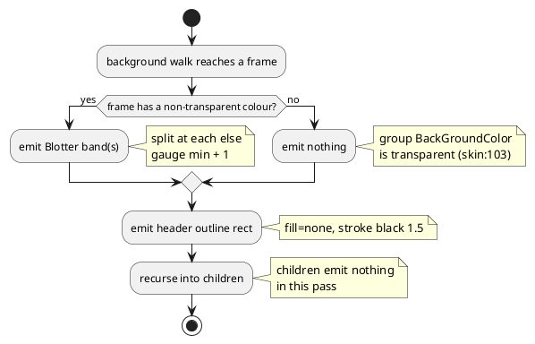

# Data flow — the five passes, and where the missing one goes

`teoz/PlayingSpaceWithParticipants#drawU:218-227`. Pass 1 is the one this
mission adds; passes 2-5 already exist as `renderer.ts` steps 1-4.

## Emission order within one grouping frame

`GroupingTile#drawU:256-275` draws its own chrome, then recurses — so the
walk is depth-first **pre-order**, and the frame's header sits between the
messages that precede it and the messages it contains.

