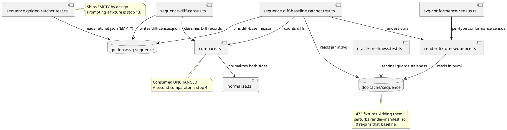

# Component map — what this mission builds

```plantuml
@startuml
component [compare.ts] as CMP
component [normalize.ts] as NRM
component [render-fixture-sequence.ts] as HELP
component [sequence.diff-baseline.ratchet.test.ts] as DIFF
component [sequence.golden.ratchet.test.ts] as GOLD
component [sequence-diff-census.ts] as CENSUS
component [svg-conformance-census.ts] as TOOL
component [oracle-freshness.test.ts] as FRESH
database "dot-cache/sequence" as CACHE
database "goldens/svg-sequence" as GOLDENS

HELP --> CACHE : reads in.puml
DIFF --> HELP : renders ours
DIFF --> CACHE : reads jar in.svg
DIFF --> CMP : counts diffs
CMP --> NRM : normalizes both sides
DIFF --> GOLDENS : pins diff-baseline.json
GOLD --> GOLDENS : reads ratchet.json (EMPTY)
CENSUS --> CMP : classifies Diff records
CENSUS --> GOLDENS : writes diff-census.json
TOOL --> HELP : per-type conformance census
FRESH --> CACHE : sentinel guards staleness

note bottom of CMP
  Consumed UNCHANGED.
  A second comparator is stop 4.
end note

note right of GOLD
  Ships EMPTY by design.
  Promoting a fixture is stop 13.
end note

note bottom of CACHE
  ~473 fixtures. Adding them
  perturbs render-manifest, so
  T0 re-pins that baseline.
end note
@enduml
```
