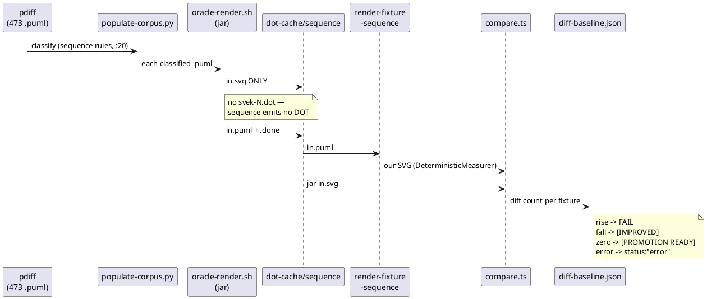
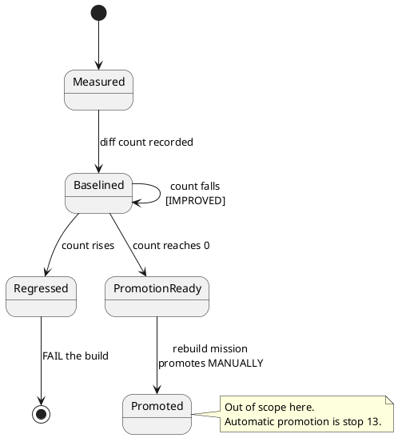

# Data flow — how a fixture becomes a baselined diff count

```plantuml
@startuml
participant "pdiff\n(473 .puml)" as P
participant "populate-corpus.py" as POP
participant "oracle-render.sh\n(jar)" as JAR
participant "dot-cache/sequence" as CACHE
participant "render-fixture\n-sequence" as OURS
participant "compare.ts" as CMP
participant "diff-baseline.json" as BASE

P -> POP: classify (sequence rules, :20)
POP -> JAR: each classified .puml
JAR -> CACHE: in.svg ONLY
note right of JAR: no svek-N.dot —\nsequence emits no DOT
JAR -> CACHE: in.puml + .done
CACHE -> OURS: in.puml
OURS -> CMP: our SVG (DeterministicMeasurer)
CACHE -> CMP: jar in.svg
CMP -> BASE: diff count per fixture
note right of BASE: rise -> FAIL\nfall -> [IMPROVED]\nzero -> [PROMOTION READY]\nerror -> status:"error"
@enduml
```

## Why the ratchet cannot be byte-identity on day one

```plantuml
@startuml
[*] --> Measured
Measured --> Baselined : diff count recorded
Baselined --> Baselined : count falls\n[IMPROVED]
Baselined --> Regressed : count rises
Regressed --> [*] : FAIL the build
Baselined --> PromotionReady : count reaches 0
PromotionReady --> Promoted : rebuild mission\npromotes MANUALLY
note right of Promoted
  Out of scope here.
  Automatic promotion is stop 13.
end note
@enduml
```
