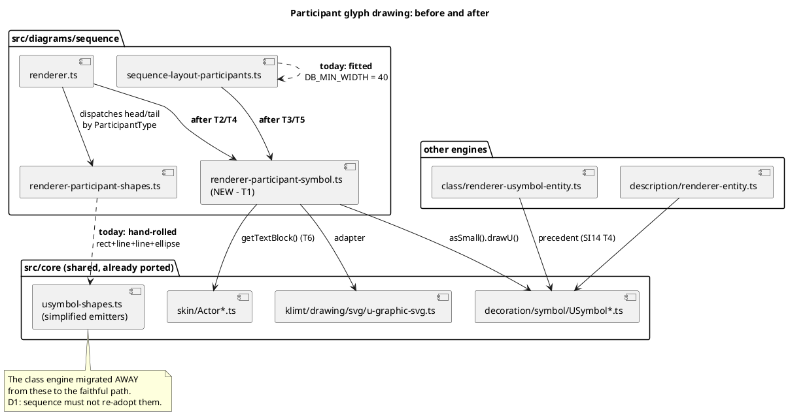

# Component map — what this mission touches

The sequence engine is the only engine still hand-rolling participant glyphs.
The class and description engines already route through the shared faithful
primitives; this mission makes sequence do the same.

## Read this before touching the seam

- `src/diagrams/class/renderer-usymbol-entity.ts:1-40` — the same move, done
  once already, with its ADR-1/ADR-2 rationale in the header comment.
- `planning/sizer-renderer-parity.md` — why the sizer and the renderer must
  move together.
