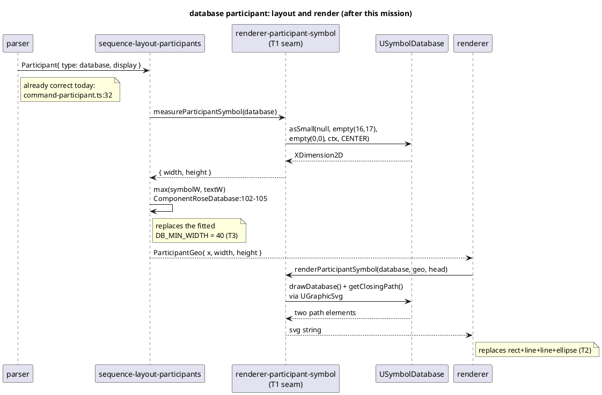

# Data flow — a `database` participant, head to SVG

The parse and AST layers are already correct: `command-participant.ts:32`
matches all eight keywords and `ParticipantType` (`ast.ts:15-24`) carries all
eight values. Everything this mission changes is downstream of the AST.

## The invariant this flow must produce

`junaxa-14-biko373` reaches the golden's 41 top-level children with histogram
`g 7, rect 6, ellipse 2, path 7, text 13, line 3, polygon 3`. Measured
before-state: 47 children, `+2 rect, +4 line, +2 ellipse, -2 path`.
