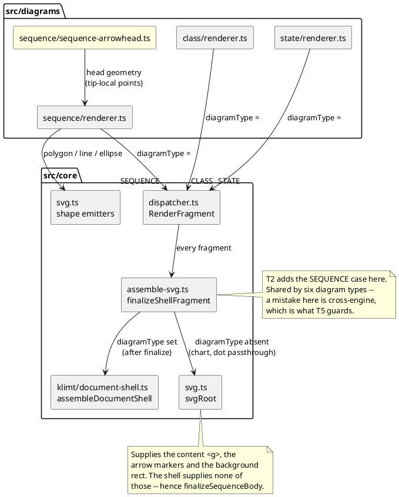

# Component map — what routes where

Today the sequence engine is the only one that reaches `svgRoot`. After this
mission it joins the five engines that reach `assembleDocumentShell`, and the
generic `svgRoot` path is left for the engines that genuinely have no jar
chrome to match (chart, dot passthrough).

