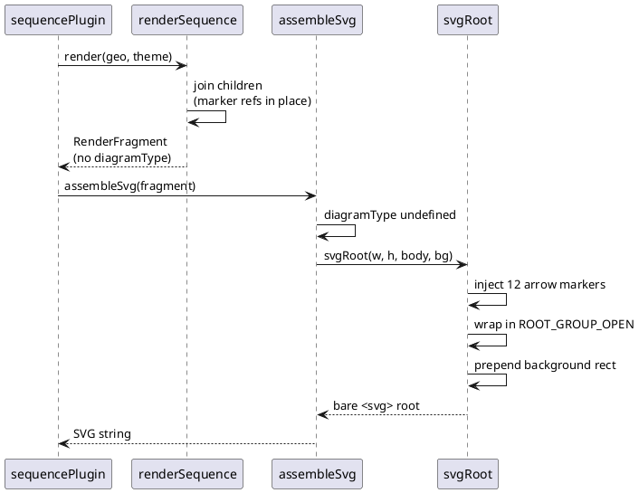
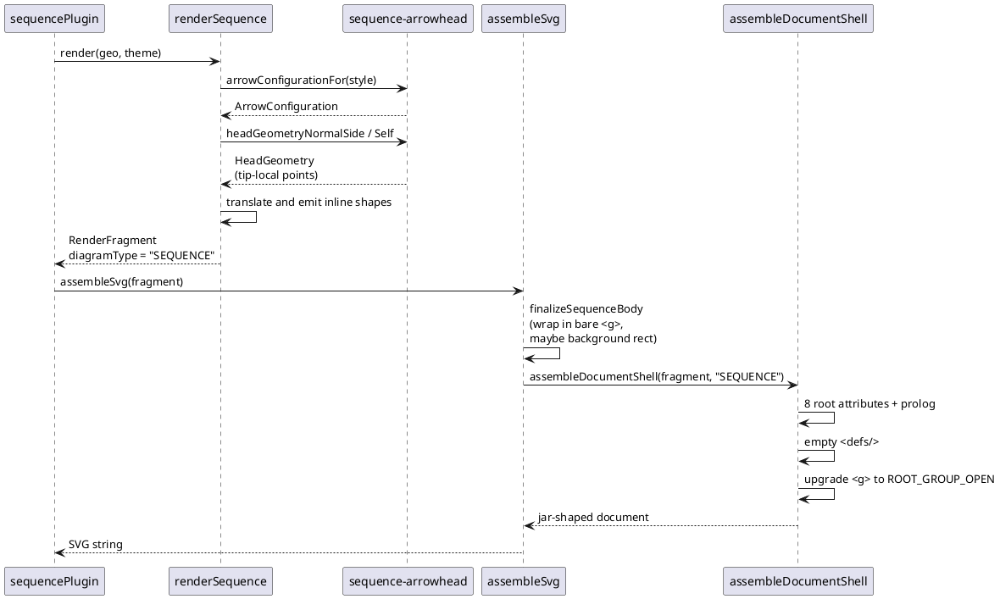

# Data flow — document assembly, before and after

The question this answers is *who calls whom, in what order*, so these are
sequence diagrams. The two differ only after the fragment is returned — the
parse and layout stages are untouched by this mission.

## Today

## After this mission

