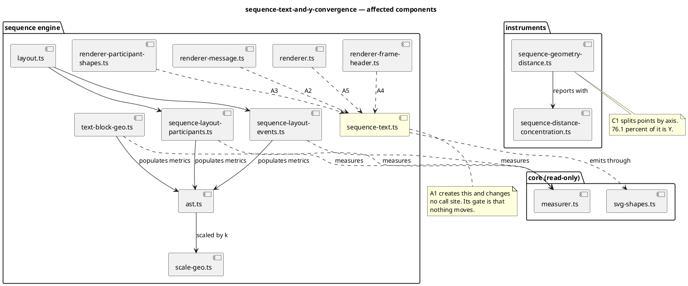

# What this mission touches

## Phase C additionally

`layout.ts` and `sequence-layout-participants.ts` gain the vertical document
margin, and `renderer-message.ts` gains the corrected loop height — **as one
change** (C3), because the margin applied alone raises total distance by
35 145.
