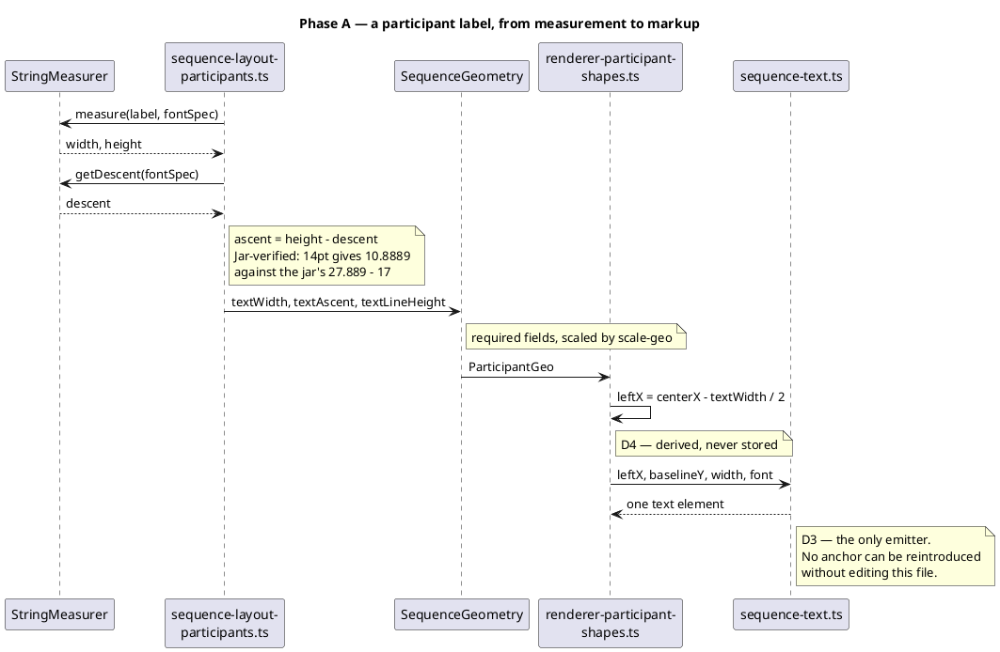
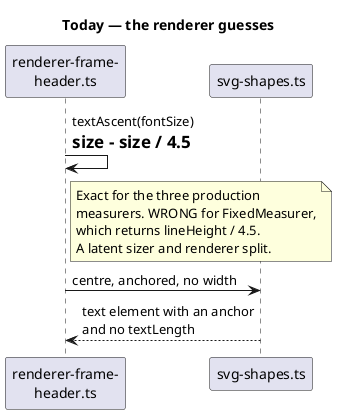

# How a text metric travels

D1 in one picture: **layout measures, the geometry carries, the renderer
formats.** The renderer never holds a measurer, so it can never disagree with
the layout that sized the box.

## What this replaces

