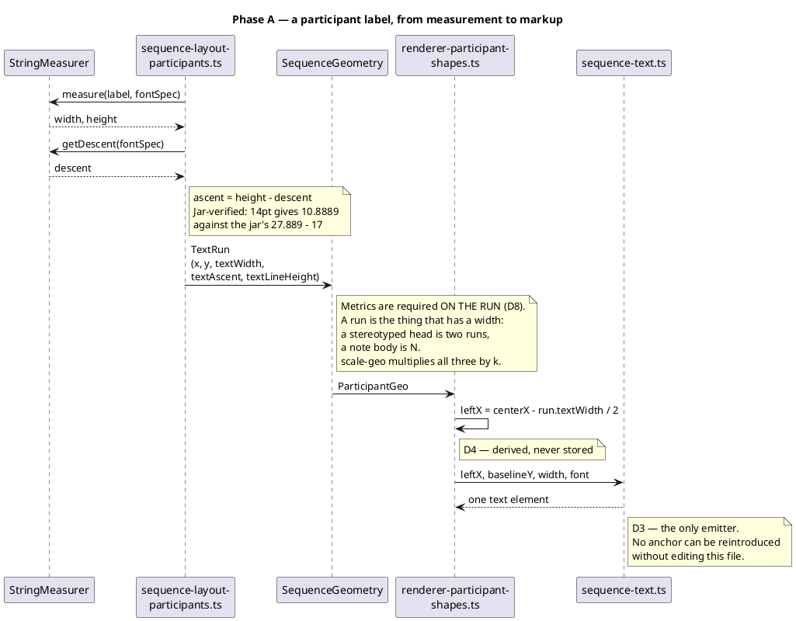
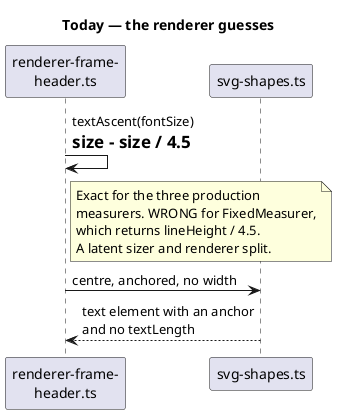

# How a text metric travels

D1 in one picture: **layout measures, the geometry carries, the renderer
formats.** The renderer never holds a measurer, so it can never disagree with
the layout that sized the box.

D8 amends the *carrier* only: the metrics ride on each `TextRun`, not as
scalars on the geometry type. The flow below is unchanged in every other
respect.

## What this replaces

