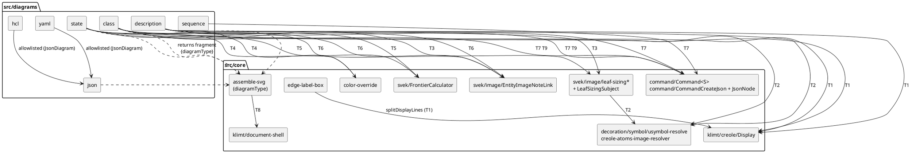

# Component map — what moves where

Proposed state after T10 (arrows = static imports that REMAIN; every former
engine→engine and core→engine edge is gone).

Retained cross-boundary edges (ALLOWLIST, D5): registry → `diagrams/*/index`
(dispatch); `yaml`/`hcl` → `json` (upstream `JsonDiagram`).
