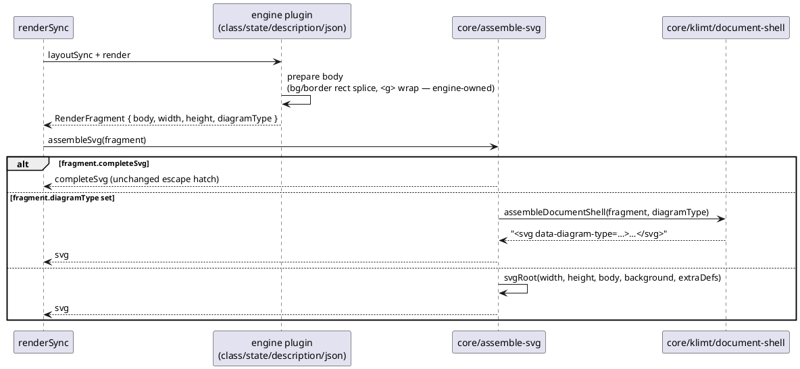
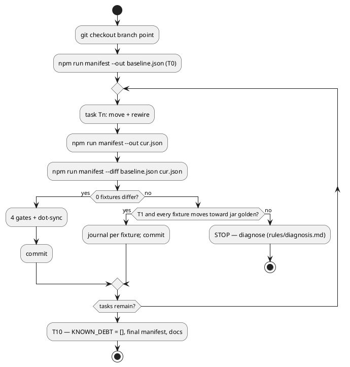

# Data flow — document assembly before/after T8

Before: core switches on four engine flags and calls four engine assemblers.
After: the engine prepares its body and names its type; core owns the one
shell (`TextBlockExporter.java:293`).

Evidence loop for every task (D6):

