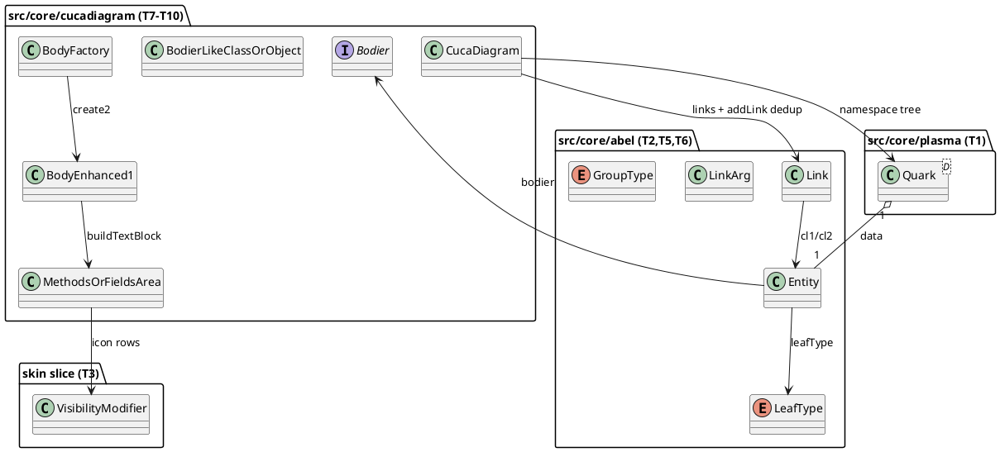

# Component map — the SI1 base and its consumers

Consumers this mission (T11/T12 only): description/class/state parsers
(dedup hook) and the two sizing narrowing sites (folder path).
@enduml is per-block; future G-missions consume the whole base.
