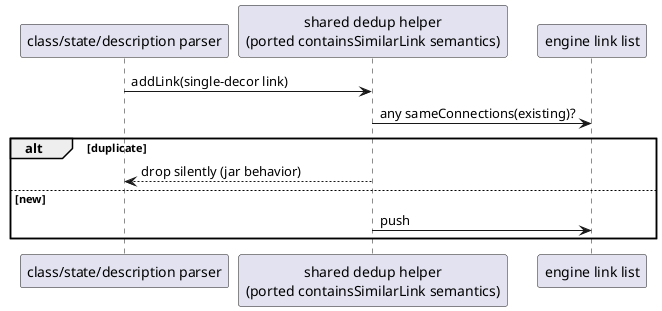
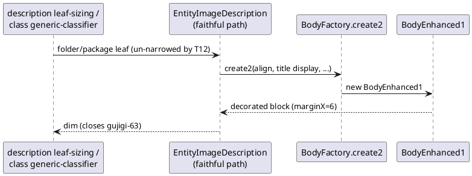

# Data flow — the two wirings

```plantuml
@startuml
participant "class/state/description parser" as P
participant "shared dedup helper\n(ported containsSimilarLink semantics)" as D
participant "engine link list" as L
P -> D : addLink(single-decor link)
D -> L : any sameConnections(existing)?
alt duplicate
  D --> P : drop silently (jar behavior)
else new
  D -> L : push
end
@enduml
```

```plantuml
@startuml
participant "description leaf-sizing /\nclass generic-classifier" as S
participant "EntityImageDescription\n(faithful path)" as E
participant "BodyFactory.create2" as B
participant BodyEnhanced1 as B1
S -> E : folder/package leaf (un-narrowed by T12)
E -> B : create2(align, title display, ...)
B -> B1 : new BodyEnhanced1
B1 --> E : decorated block (marginX=6)
E --> S : dim (closes gujigi-63)
@enduml
```
