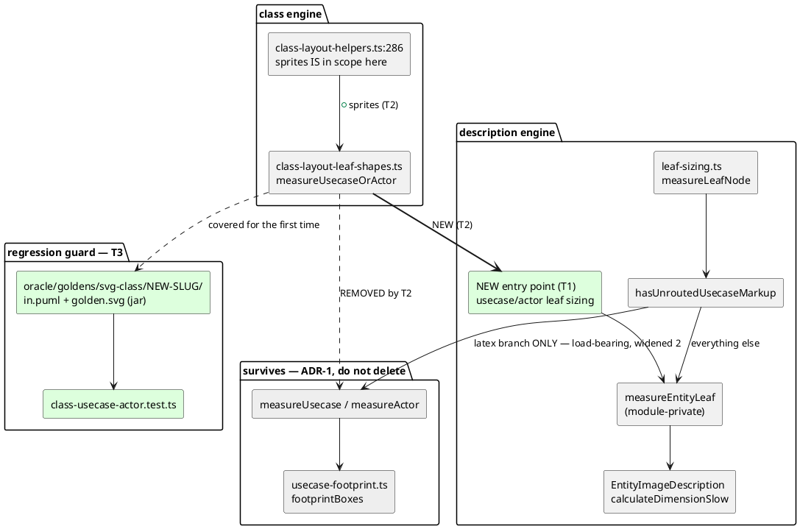

# Component map — what SI10 touches

`measureUsecase` has two callers. This mission closes the class-engine one
and removes the inert half of the description-engine guard. Everything in
the "survives" package stays.

Note: the labels below say "latex branch" and "sprite atom" in prose rather
than the literal markup — inside a PlantUML diagram, `<latex>` would be
typeset and `<$name>` would be resolved as a sprite. See CLAUDE.md
§ Diagrams.

## The coverage hole this mission closes

| corpus | fixtures | containing `usecase`/`actor`/`allowmixing` |
|---|---|---|
| `oracle/goldens/svg-class/` | 310 | **0** |

Nothing in the class corpus exercises the path SI10 changes. That is why T3
is a batch of its own rather than a footnote on T2.
