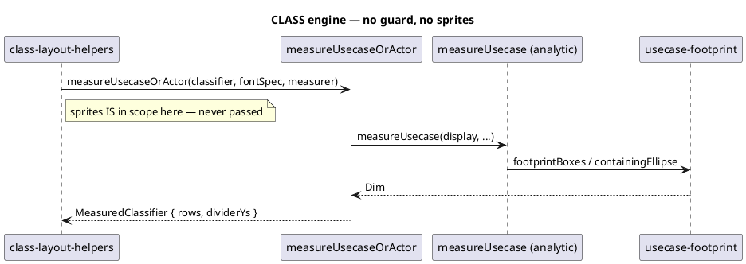
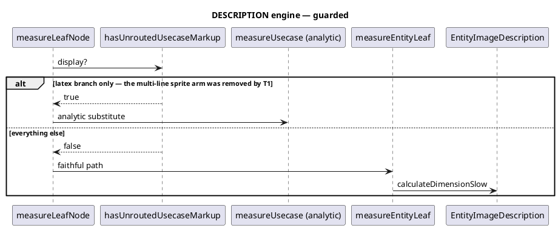
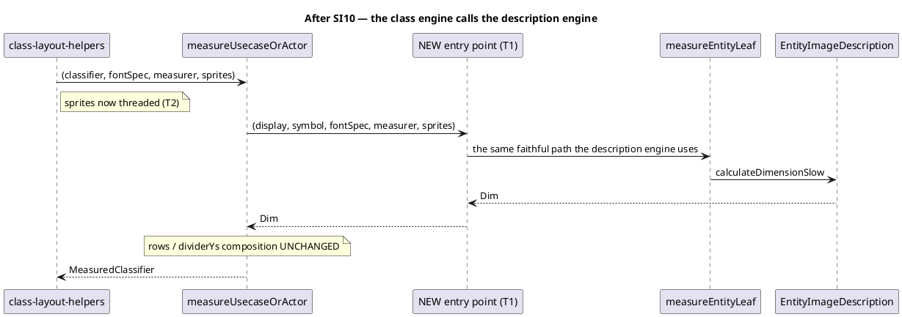

# Data flow — before and after

Labels say "latex branch" and "sprite atom" rather than the literal markup:
inside a PlantUML diagram `<latex>` is typeset and `<$name>` resolves as a
sprite. See CLAUDE.md § Diagrams.

## Before: two engines, two answers for one shape

## After: one owner, one formula

The description engine's guard keeps only its latex arm — measured
load-bearing at `widened 2`. The multi-line sprite arm is gone, measured
inert at `widened 0`.

## Why the sprite arm could be removed and the latex arm could not

| probe | `widened` |
|---|---|
| baseline | 0 |
| sprite arm disabled | **0** — inert |
| both arms disabled | **2** — latex is load-bearing |

Both named fixtures (`bootstrap-0`, `ruziru-69-xixo434`) report `delta 0,
conformant true` with and without the sprite arm.
