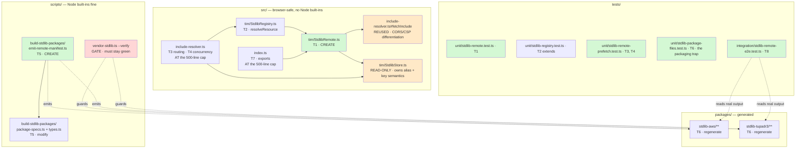
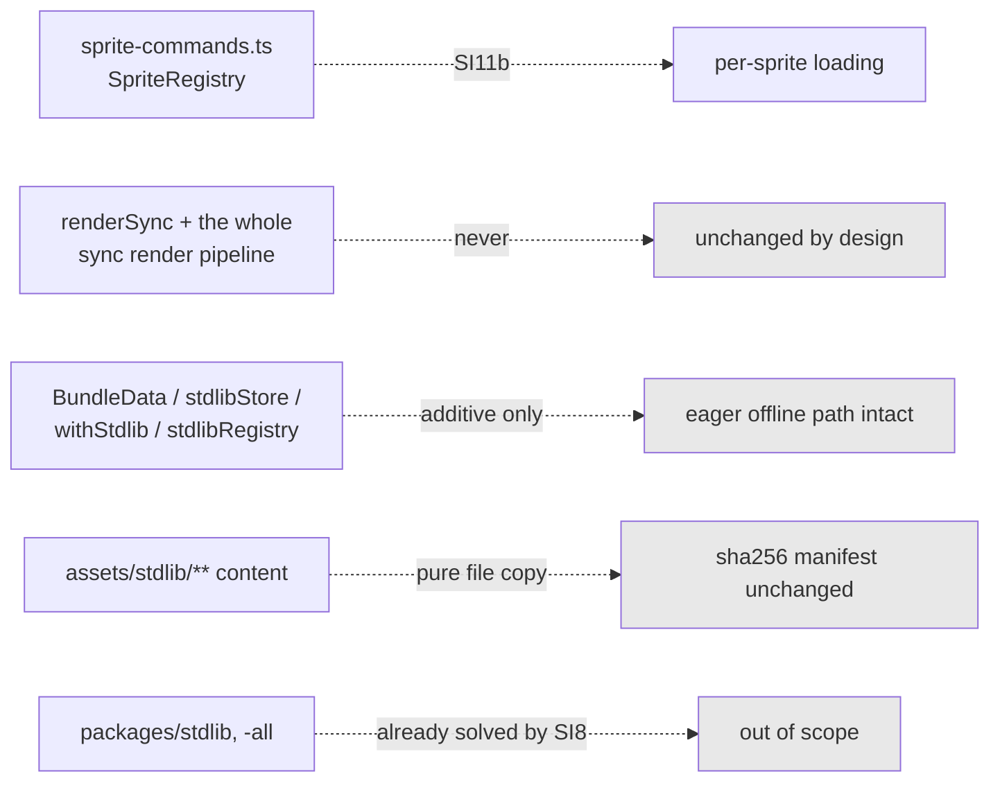

# Component map — what SI11a touches

Green = created. Orange = deliberately read-only reuse. Red = the gate that
proves stop condition 5 was not violated.

## What is NOT touched — and why that matters

The sync pipeline's exclusion is structural, not incidental: `renderSync` cannot
await, so every byte of this mission lives in the async prefetch pass.
